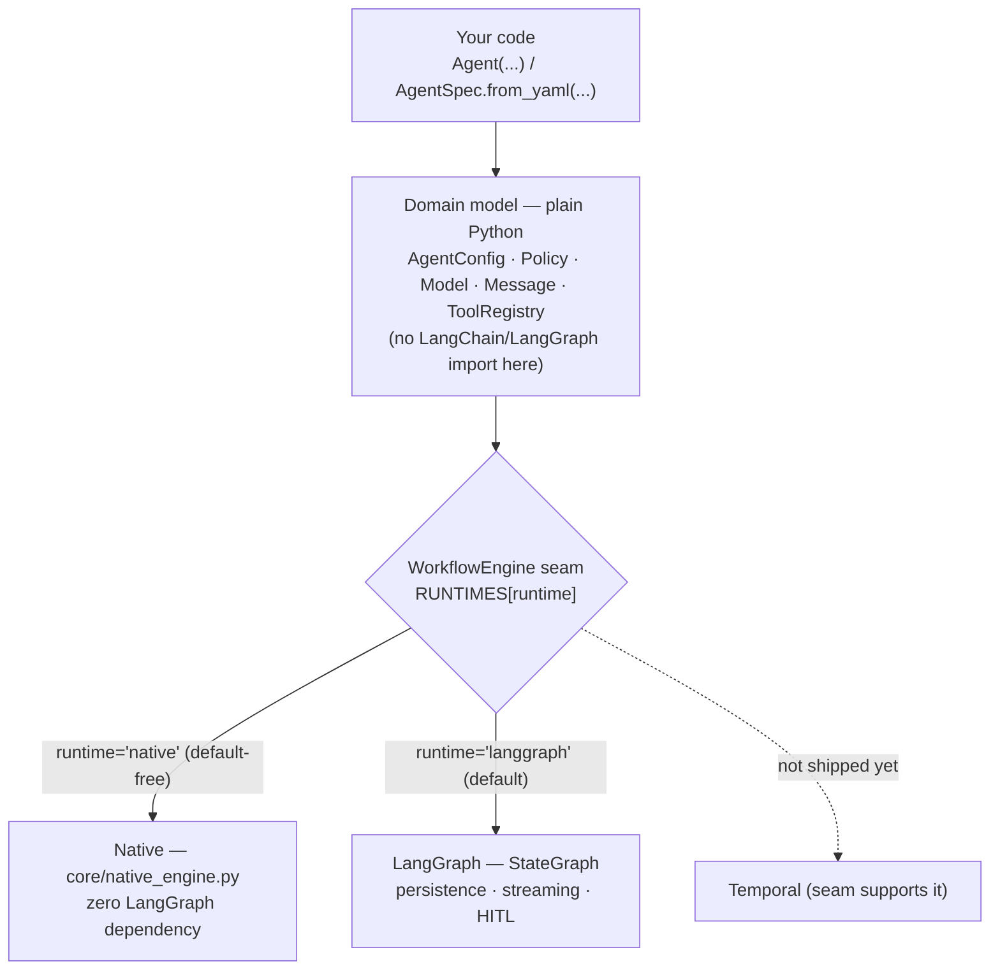
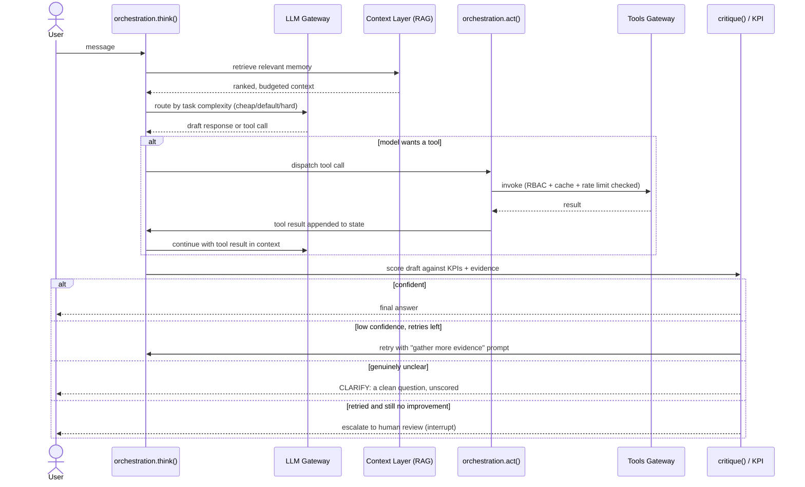
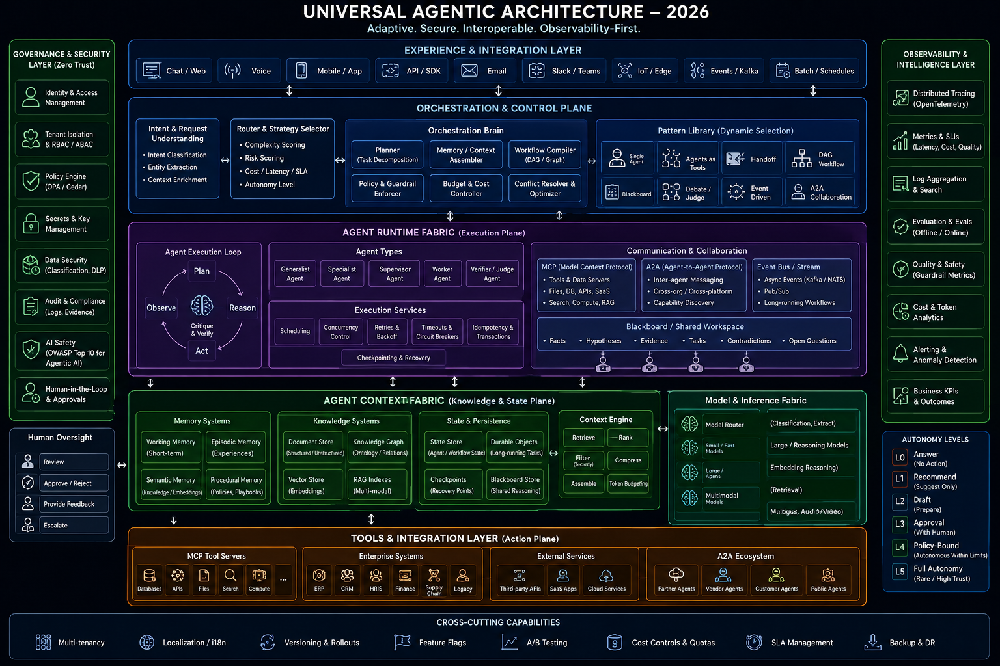

# Agent Foundry

[](https://github.com/arghya05/agent-foundry/actions/workflows/test.yml)
[](https://github.com/arghya05/agent-foundry/actions/workflows/build.yml)
[](https://github.com/arghya05/agent-foundry/actions/workflows/security.yml)


Built by **Arghya Mukherjee**, CTO at Algonomy — a reference architecture for
taking a 0-to-1 startup from idea to a production-grade agentic product fast,
without re-deriving the governance, memory, and multi-agent primitives from
scratch each time.

**Agent Foundry is an opinionated production runtime for governed AI
agents, not a framework built on top of any one of them.** `Agent`, the
domain model (`AgentConfig`/`Policy`/`Identity`/`Model`/`Message`/`Tool`/
`Memory`/`Guardrail`/`Evaluator`), and the governance/eval/observability
layers are plain Python — dataclasses and `Protocol`s, no LangChain or
LangGraph import anywhere in that path (verified: `grep` for either across
`orchestration.py`/`core/agent.py` returns nothing). Execution is pluggable
behind one seam (`core.protocols.WorkflowEngine`, dispatched through a
`RUNTIMES` registry — see [Runtime backends](#runtime-backends-native-langgraph-and-what-plugs-in-next)):
`runtime="native"` is a complete, from-scratch implementation of the same
think/act/critique loop with zero LangGraph dependency; `runtime="langgraph"`
(the default) runs the identical loop through LangGraph's `StateGraph` for
its persistence/streaming/HITL machinery. Define an agent once; run it as a
single agent, supervisor, swarm, debate, DAG, or agent-as-tool, on whichever
backend you choose — per `Agent`, or per call.

LangChain shows up in exactly one place: `quickstart.py`'s
`plug_and_play_agent()`, a deliberately separate, minimal entry point built
on real `langchain.agents.create_agent` for teams that want the simplest
possible start (see [Two entry points](#two-entry-points-by-how-much-governance-you-need)) —
entirely optional (`pip install agent-foundry[langchain]`), and nothing
`Agent` itself does depends on it.

> **36+ modules** · a Python-native domain model (`Agent`/`AgentSpec`/
> `Model`/`Message`/`Policy`/`ToolRegistry`/`ExecutionContext`) behind a
> pluggable `WorkflowEngine` seam · two real execution backends today
> (native Python, zero LangGraph dependency, and LangGraph, chosen per-`Agent`
> or per-call) · **7 multi-agent topologies** · a declarative `AgentSpec`
> (YAML/JSON) alongside the Python API, with structured tool metadata and
> named critique evaluators · `arun`/`astream` and concurrent same-turn tool
> dispatch · a formal run lifecycle and eval-as-release-gate (KPI board,
> trajectory checks, versioned datasets, baseline regression comparison,
> pairwise comparison, failure attribution) on one shared core · **460+
> tests passing**, ruff/mypy-clean CI · MCP / A2A / AutoGen / CrewAI
> protocol interop built in



*(The full picture — tools, memory, guardrails, eval, every layer — is the
[detailed diagram](#architecture) further down; this is just the "what
runs my agent" choice.)*

**Jump to:** [Why this helps a startup](#why-this-helps-a-0-to-1-startup) ·
[Architecture](#architecture) ·
[Problem → solution table](#problem--platform-service--what-solves-it-here) ·
[Module reference](#module-reference) · [Security](#security) ·
[Build your own agent](#building-your-own-agent) ·
[Testing](#testing) · [Docs](#docs)

## Why this helps a 0-to-1 startup

The stuff that normally gets skipped under startup time pressure — and then
costs a rewrite once a customer actually needs it — is already here, so the
skip never has to happen:

- **Week 1**: `python -m agent_foundry.scaffold` gets a runnable agent with
  tools, guardrails, and tracing already wired — fill in the prompt and tool
  bodies, not the plumbing. A week of infra work becomes an afternoon.
- **First paying customer**: RBAC (`Policy.allowed_tools`), fail-closed cost
  budgets, and an audit trail are already there — a security questionnaire
  doesn't send you scrambling to retrofit access controls under deadline.
- **First bad answer in front of a customer**: the critique loop already
  retries with more evidence, asks a clarifying question instead of guessing,
  and only escalates to a human when retrying genuinely didn't help — not a
  raw LLM call with no safety net.
- **Product grows past one agent**: swap `build_agent_graph` for
  `build_supervisor_graph` (or swarm/debate/DAG) — same `AgentConfig`s, same
  tools, no rewrite, because you were never on a bespoke single-agent script.
- **You need to prove it's improving**: `experiments.py`/`kpi.py` give real
  A/B variant assignment and scored metrics from day one, instead of "we
  think the new prompt is better."

## Two entry points, by how much governance you need

- **`quickstart.plug_and_play_agent`** — a junior developer's whole agent in
  ~5 lines, built on real `langchain.agents.create_agent`. No `ToolSpec`, no
  JSON schema — plain Python functions with type hints and a docstring.
- **`orchestration.build_agent_graph`** — the governed path: RBAC, guardrails,
  eval, cost/audit, autonomy levels, retry-with-more-evidence, human-in-the-loop
  escalation, multi-agent topologies. `quickstart.to_langchain_tool()` bridges
  a tool already registered in a governed `ToolRegistry` back into the simple
  path, so a team can start on the left and grow into the right without
  rewriting tools.

See `examples/support_agent.py` for a complete agent built from these
pieces, `examples/research_agent/`, `examples/commerce_agent/`, and
`examples/autonomous_workflow/` for three fuller reference apps (each with
an imperative `agent.py`, a declarative `agent.yaml`, and a versioned eval
dataset), and `PLAN.md`/`docs/ARCHITECTURE.md` for the full design
rationale.

## Architecture

```mermaid
flowchart TD
    User["Client / End User"]

    subgraph Entry["Entry Points"]
        Core["agent_foundry.core — Agent / Workflow\nrun/stream/resume/batch/schedule/as_tool/on\nruntime chosen per-Agent or per-call\nno LangGraph/LangChain import in this surface"]
        Spec["agent_spec.py — AgentSpec\ndeclarative YAML/JSON/dict:\nstructured tools, named critique evaluators"]
        Quick["quickstart.py\nplug_and_play_agent() — the one place\nreal LangChain (create_agent) is used"]
        Serve["serve.py\nFastAPI + browser chat UI + HITL"]
        Channels["channels.py\nSlack (concrete adapter) — same pattern extends to SMS/email/Teams"]
        A2A["a2a_bridge.py\nAgent2Agent protocol"]
    end

    subgraph Engines["core/engines.py — the RUNTIMES seam Agent actually dispatches through"]
        direction LR
        WFEngine["core.protocols.WorkflowEngine\nbuild/run/stream/resume, @runtime_checkable"]
        Registry["RUNTIMES = {native: NativeWorkflowEngine(),\nlanggraph: LangGraphWorkflowEngine()}\n— a 3rd backend (Temporal) is one more entry"]
        WFEngine --> Registry
    end

    subgraph Loop["orchestration.py — runtime=langgraph (LangGraph StateGraph)"]
        direction LR
        Think["think()\nprompt + context -> LLM"] --> Act["act()\ntool calls, RBAC-checked"]
        Act --> Think
        Think --> SelfVerify["self_verify()\noptional revise pass"]
        SelfVerify --> Critique["critique()\nKPI-scored gate"]
        Critique -- "below threshold,\nretries left" --> Think
        Critique -- "CLARIFY:" --> Question(["ask the user\ninstead of guessing"])
        Critique -- "no improvement,\nescalate_threshold" --> HITL(["human-in-the-loop\ninterrupt()"])
        Critique -- passes --> Final(["final answer"])
    end

    subgraph NativeLoop["core/native_engine.py — runtime=native (plain Python, zero LangGraph)"]
        direction LR
        NThink["_think()\nsame prompt+context -> LLM"] --> NAct["_act()\nsame RBAC-checked tool calls"]
        NAct --> NThink
        NThink --> NCritique["_critique()\nsame KPI-scored gate"]
        NCritique -- "escalate" --> NHITL(["pause: a plain dict flag,\nresume() continues the loop"])
        NCritique -- passes --> NFinal(["final answer"])
    end

    subgraph Model["LLM Gateway — Layer 05"]
        ModelRouter["core/model_router.py\ncapability-based selection\n(ModelRequest -> routes[task])"]
        LLMG["llm_gateway.py\ntask -> model routing (cheap/default/hard)\nprovider failover, cost metering, prompt cache"]
        ModelRouter --> LLMG
    end

    subgraph Tool["Tools Gateway — Layer 04"]
        ToolDecorator["core/tool_decorator.py\n@tool(...) — real timeout + cache_ttl,\npermissions metadata"]
        ToolsG["tools_gateway.py\nregistry, RBAC scopes,\nresult cache, rate limiter,\nidempotency store"]
        MCP["mcp_tools.py — any MCP server"]
        HTTP["http_tools.py — any REST API"]
        AutoGen["autogen_bridge.py — AutoGen agent as a tool"]
        CrewAI["crewai_bridge.py — CrewAI crew as a tool"]
        DataConn["data_connectors.py — SQL / warehouses"]
        ToolDecorator --> ToolsG
    end

    subgraph Context["Context Layer — Layer 06"]
        Mem["context.py\nworking / episodic / semantic (RAG) /\nprocedural memory + knowledge graph +\nuser & org profiles"]
    end

    subgraph Runtime["Harness / Runtime — Layer 03"]
        RT["runtime.py\nRunBudget · LatencyBudget ·\nCircuitBreaker · RateLimiter · SLATracker\n(all behind swappable *Like Protocols)"]
    end

    subgraph Governance["Guardrails & Security"]
        GR["guardrails.py — input/output/action gates"]
        Sec["security.py — signed tool manifests,\negress allowlist, audit trail"]
        Policy["policy_engine.py — OPA/Rego policy-as-code"]
        Escalation["escalation.py — auto-approve / deny / escalate"]
        Sandbox["sandbox.py — restricted-namespace code execution"]
    end

    subgraph Measure["Eval, Observability & Optimization"]
        KPI["kpi.py — composable scoring functions"]
        Eval["eval.py — atomic / component / flow / overall"]
        EvalGate["core/evalgate.py\nrun_eval() -> Scorecard\n.passes(thresholds) release gate"]
        Obs["observability.py — tracing, cost ledger, SLA dashboards"]
        Bench["benchmark.py — regression suite against a compiled graph"]
        Exp["experiments.py — A/B variant assignment + metrics"]
        Flags["feature_flags.py — on/off & % rollout"]
        Reinforce["reinforcement.py — eval signal -> prompt/policy/model"]
        Plan["planning.py — Objectives scored against KPIs"]
        EvalGate --> KPI
    end

    subgraph Cross["Cross-cutting"]
        ExecCtx["core/execution_context.py\nExecutionContext — run_id/thread_id/session_id/\nuser_id/tenant_id/agent_id/trace_id/permissions/budget"]
        RunLifecycle["core/run.py\nRun — STARTED/RUNNING/WAITING_HUMAN/WAITING_EVENT/\nSUSPENDED/COMPLETED/FAILED/CANCELLED\npause/unpause/cancel/retry/fork/replay/wait_for_event"]
        Registries["core/registries.py\nPromptRegistry · PolicyRegistry · EvalRegistry\n(named lookup -> Agent(instructions=/policy=/eval_harness=))"]
        Events["events.py — pub/sub event bus\n(Agent.on(topic) wires an agent's own graph to it)"]
        Blackboard["blackboard.py — shared multi-agent workspace"]
        Version["versioning.py — rollback for prompts/policy docs"]
        I18n["i18n.py — locale-aware prompts & formatting"]
        Batch["batch.py — batch & scheduled runs\n(Agent.batch()/.schedule() delegate here)"]
        Scaffold["scaffold.py — generate a new agent's starting files"]
        Contracts["contracts.py — Identity, Policy, ToolSpec,\nModel (=Provider), Message, LLMResponse…\nthe types every layer plugs into"]
    end

    User --> Core & Spec & Quick & Serve & Channels & A2A
    Spec --> Core
    Quick & Serve & Channels & A2A --> Loop
    Core --> Registry
    Registry -- "langgraph (default)" --> Loop
    Registry -- "native" --> NativeLoop
    Core --> ExecCtx
    Core -. "agent.start(msg)" .-> RunLifecycle
    Core -. "run_eval(agent, cases)" .-> EvalGate
    Registries -.-> Core
    Think --> LLMG
    Act --> ToolsG
    NThink --> LLMG
    NAct --> ToolsG
    ToolsG --> MCP & HTTP & AutoGen & CrewAI & DataConn
    Think --> Mem
    NThink --> Mem
    Loop --> RT
    NativeLoop --> RT
    Act --> GR
    NAct --> GR
    Act --> Sec
    GR --> Policy
    Act -. "requires_approval" .-> Escalation
    ToolsG -. "sandboxed tools" .-> Sandbox
    Critique --> KPI --> Eval
    NCritique --> KPI
    Loop --> Obs
    Loop -. "variant_assignment" .-> Exp
    Loop -. "gated behavior" .-> Flags
    Eval -. "closes the loop" .-> Reinforce
    Reinforce -. "scored against" .-> Plan
    Loop --> Events
    Core -. "agent.on(topic)" .-> Events
    Loop -. "multi-agent" .-> Blackboard
    Contracts -.-> Loop
    Contracts -.-> ToolsG
    Contracts -.-> Mem
```



### The think → act → critique loop, in one picture



High-definition JPG exports of both diagrams (and their `.mmd` source) live in
[`docs/diagrams/`](docs/diagrams/) — useful for slides or docs that can't
render Mermaid.

The diagram below is a broader reference architecture (experience layer,
orchestration/control plane, runtime fabric, context fabric, tools/
integration layer, cross-cutting capabilities) this codebase was checked
against — most of it maps directly onto real modules above; see the
[problem → platform service
table](#problem--platform-service--what-solves-it-here) for the concrete
mapping.



## Problem → platform service → what solves it here

Every one of these is a named platform-service concern any production agent
eventually needs — the third column is what actually implements it in this
repo, not just the concept:

| Problem | Platform service | Solved by (this repo) |
|---|---|---|
| No memory between messages | Session Service | `orchestration.py` — `AgentState` + a real `checkpointer` (`MemorySaver`/`SqliteSaver`/`PostgresSaver`) |
| Forgets across sessions | Session Service (memory layer) | `context.py` — `MemoryStore.profiles`, loaded via `AgentConfig.user_id` every turn regardless of thread |
| Hallucinates organizational facts | Data Service (RAG) | `context.py` — semantic memory (RAG) + `ContextEngine`; `data_connectors.py` for structured sources |
| Cannot take actions | Tool Service + MCP | `tools_gateway.py` — RBAC-scoped `ToolRegistry`; `mcp_tools.py` bridges any MCP server in |
| Unsafe actions and responses | Guardrails Service | `guardrails.py` (input/output/action gates) + `security.py` (signed manifests, audit) + `policy_engine.py` (OPA/Rego) |
| Cannot see what happened | Observability Service | `observability.py` — tracing, `CostLedger`, SLA dashboards |
| Cannot measure improvement | Experimentation Service | `experiments.py` (A/B variant assignment) + `kpi.py` + `eval.py` (atomic/component/flow/overall) |
| Cannot deploy and scale | Workflow Service | `serve.py` + `Dockerfile` (any cloud that runs a container) + `distributed.py`'s Redis-backed budget/cache/rate-limiter/SLA/cost-ledger for real multi-replica scaling |
| Model vendor lock-in | Model Service | `llm_gateway.py` — `Provider` protocol, task→model routing, provider failover |

## Module reference

36 modules, grouped the same way as the architecture diagram above. Every
"Provides" entry is a real class or function actually defined in that file.

### Foundation

| Module | Provides | For |
|---|---|---|
| `contracts.py` | `Identity`, `Policy`, `ToolSpec`, `ToolResult`, `ToolCall`, `LLMResponse`, `AgentRole`, `AutonomyLevel` | The types every other layer plugs into — read this file first |
| `prompts.py` | `PromptLibrary`, `VersionedPromptLibrary`, `load_prompt()` | Loads prompts as plain text/markdown files, not Python string literals |

### Core loop — Layer 02

| Module | Provides | For |
|---|---|---|
| `orchestration.py` | `AgentConfig`, `CritiqueConfig`, `AgentState`, `make_think_node`, `make_act_node`, `make_critique_node`, `make_self_verify_node`, and all 7 `build_*_graph` topology builders | The think/act/critique loop itself — everything else in this repo is a slot it calls into |
| `core/native_engine.py` | `NativeEngine` | A second, framework-free implementation of the same think/act/critique loop — `Agent(..., runtime="native")` |
| `core/run.py` | `Run`, `RunStatus` | `Agent.start()`'s formal run lifecycle — pause/unpause/cancel/retry/fork/replay/wait_for_event |
| `core/evalgate.py` | `run_eval()`, `EvalCase`, `Scorecard` | Evaluation-as-release-gate — score an Agent against a dataset, `.passes(thresholds)` |

### Runtime, tools & model — Layers 03–05

| Module | Provides | For |
|---|---|---|
| `runtime.py` | `RunBudget`, `LatencyBudget`, `CircuitBreaker`, `RateLimiter`, `SLATracker` — each with a swappable `*Like` Protocol | Per-thread cost/step/latency budgets, retries, circuit breaking |
| `distributed.py` | `RedisRunBudget`, `RedisRateLimiter`, `RedisToolCache`, `RedisSLATracker`, `RedisCostLedger` | Real cross-replica versions of the above, backed by Redis — for a genuine multi-node deployment |
| `tools_gateway.py` | `ToolRegistry`, `ToolCache`, `InMemoryIdempotencyStore`, `tool_json_schema` | RBAC-scoped tool invocation, result caching, idempotency |
| `mcp_tools.py` | `MCPToolSource` | Any stdio/HTTP MCP server's tools, registered into a `ToolRegistry` |
| `http_tools.py` | `http_tool()` | Wraps any REST endpoint as a `ToolSpec`, no MCP server needed |
| `autogen_bridge.py` | `autogen_as_tool()` | A Microsoft AutoGen agent as a single tool call |
| `crewai_bridge.py` | `crewai_as_tool()` | A CrewAI crew as a single tool call |
| `data_connectors.py` | `DataSource` (Protocol), `SQLiteDataSource`, `data_query_tool()` | Structured data (SQL, warehouses) — distinct from `context.py`'s unstructured RAG |
| `llm_gateway.py` | `LLMGateway`, `AnthropicProvider`, `OpenAIProvider`, `MultiProvider`, `PromptCache`, `ModelRegistry`, `make_llm_judge()` | Task→model routing (cheap/default/hard), provider failover, cost metering |

### Context Layer — Layer 06

| Module | Provides | For |
|---|---|---|
| `context.py` | `VectorStore` (Protocol), `InMemoryVectorStore`, `ChromaVectorStore`, `KnowledgeGraphStore`, `ProceduralMemory`, `retrieval_tool()`, `memory_write_tool()`, `profile_write_tool()` | Working/episodic/semantic (RAG)/procedural memory, knowledge graph, cross-session profiles |

### Guardrails & security

| Module | Provides | For |
|---|---|---|
| `guardrails.py` | `GuardrailEngine`, `LLMGuardrails`, `redact()`, `looks_like_injection()` | Input/output/action gates — regex/heuristic by default, LLM-based via `LLMGuardrails` |
| `security.py` | `ToolManifestRegistry`, `EgressPolicy`, `CredentialVault`, `VaultCredentialProvider`, `AuditLog`, `EncryptedJSONLAuditLog` | Signed tool manifests, egress allowlisting, encrypted audit trail |
| `policy_engine.py` | `OPAPolicyEngine`, `CedarPolicyEngine` | Real policy-as-code (Rego or Cedar), alongside or instead of `Policy` |
| `escalation.py` | `EscalationTicket`, `QueueEscalator` | The third outcome besides auto-approve/deny |
| `sandbox.py` | `run_sandboxed()`, `code_execution_tool()` | Restricted-builtins, wall-clock-timeout execution for untrusted code |

### Eval, observability & optimization

| Module | Provides | For |
|---|---|---|
| `kpi.py` | `KPI`, `KPIBoard`, `KPIResult`, `efficiency_kpi()`, `conciseness_kpi()`, `policy_adherence_kpi()`, `word_overlap()` | Composable scoring functions guardrails/eval/planning all build on |
| `eval.py` | `EvalHarness`, `JSONLEvalSink` | Atomic / component / flow / overall evaluation levels |
| `observability.py` | `Tracer`, `OTelTracer`, `Metrics`, `CostLedger`, `check_alerts()` | Tracing, cost ledger, alerting, dashboards |
| `benchmark.py` | `BenchmarkCase`, `CaseResult`, `BenchmarkReport`, `run_benchmark()` | Regression suite against any compiled graph |
| `experiments.py` | `Experiment`, `ExperimentTracker` | Deterministic A/B variant assignment + per-variant metrics |
| `feature_flags.py` | `FeatureFlagProvider` (Protocol), `StaticFeatureFlagProvider` | On/off and percentage-rollout switches |
| `reinforcement.py` | `PromptOptimizer`, `PreferenceStore` | Closes eval signal back into prompt/policy/model |
| `planning.py` | `Objective`, `Planner`, `StrategySelector`, `BanditSelector` | `Objectives` scored against whatever KPIs are registered |

### Integration & cross-cutting

| Module | Provides | For |
|---|---|---|
| `events.py` | `EventBus` (Protocol), `InMemoryEventBus`, `KafkaEventBus`, `wire_event_driven()` | Pub/sub for async/cross-agent events |
| `blackboard.py` | `Blackboard`, `parse_post()` | Shared reasoning workspace for multi-agent graphs |
| `a2a_bridge.py` | `agent_card_for()`, `build_a2a_app()` | Makes an agent discoverable/callable over the open A2A protocol |
| `serve.py` | `build_http_app()`, `invoke_graph_chat_turn()` | Minimal FastAPI wrapper: browser chat UI + human-in-the-loop approval |
| `channels.py` | `build_slack_app()`, `verify_slack_signature()` | Connects an external messaging surface (Slack, etc.) to a compiled graph |
| `versioning.py` | `VersionStore` (Protocol), `FileVersionStore` | Rollback for prompts/policy documents |
| `i18n.py` | `LocaleSpec`, `register_locale()`, `format_currency()`, `format_date()` | Locale-aware prompt variants and response formatting |
| `batch.py` | `Scheduler` (Protocol), `IntervalScheduler`, `run_batch()`, `BatchReport` | Batch & scheduled runs — distinct from `build_fanout_graph`'s in-turn parallelism |
| `scaffold.py` | CLI: `python -m agent_foundry.scaffold` | Generates a new agent's starting files in seconds |
| `quickstart.py` | `plug_and_play_agent()`, `to_langchain_tool()` | The plug-and-play entry point on real LangChain primitives |

## Security

Threaded through the architecture, not bolted on — the Governance &
Security layer in the diagram above is a real code path, not a diagram-only
box. What's actually there:

- **RBAC** — every tool call is checked against `Policy.allowed_tools` for
  the calling `Identity`, before it executes (`tools_gateway.py`)
- **Signed tool manifests** — `ToolManifestRegistry.pin()` fingerprints a
  tool's schema; later drift fails `.verify()` (`security.py`)
- **Egress allowlisting** — `EgressPolicy` (`security.py`)
- **Audit trail** — every tool call, approval decision, and clarification
  request is recorded via `AuditLog` (plain JSONL) or `EncryptedJSONLAuditLog`
  (Fernet-encrypted at rest) (`security.py`)
- **Policy-as-code** — OPA/Rego or Cedar as an alternative to the built-in
  `Policy`, for teams that want real policy engines (`policy_engine.py`)
- **Guardrails** — input/output/action gates, regex/heuristic by default
  (`GuardrailEngine`, zero extra dependencies), with an LLM-based option
  (`LLMGuardrails`) layered on top (`guardrails.py`)
- **Sandboxed execution** — untrusted code runs with a restricted builtins
  namespace and a wall-clock timeout (`sandbox.py`)
- **Pluggable secrets** — `SecretsProvider` Protocol + `VaultCredentialProvider`
  (`security.py`) — nothing hardcoded
- **Human-in-the-loop** — `Policy.requires_approval` pauses a destructive
  tool call for a real approval decision before it runs; `escalation.py` is
  the third outcome besides auto-approve/deny
- **OWASP LLM Top 10** — `docs/OWASP_LLM_TOP10.md` walks through how each of
  the ten risks is addressed

**The honest gap, worth stating plainly rather than glossing over**: the
default guardrails are regex/heuristic, not a trained prompt-injection
classifier — real adversarial-input defense at scale should layer
`LLMGuardrails` or a dedicated classifier on top, not rely on the default
alone. Runtime enforcement (`RunBudget`, `RateLimiter`, `ToolCache`,
`SLATracker`) is in-process *by default* — a fresh install is single-process
until you configure otherwise — but this is now a closed gap, not an open
one: `agent_foundry/distributed.py` has real, Redis-backed, cross-replica
versions of all of them, tested against a live Redis to prove they actually
share state across separate instances (see [Deploying to any cloud, at real
scale](#deploying-to-any-cloud-at-real-scale--not-just-portably)).

## Building your own agent

There are four ways in, in increasing order of governance. Pick the one that
matches what you're building — you can start on the left and grow into the
right without rewriting your tools (`quickstart.to_langchain_tool()` bridges
a governed `ToolRegistry` tool back into the simple path).

### 1. Scaffold it (fastest way to a runnable file)

```bash
python -m agent_foundry.scaffold sales_agent --tools lookup_lead,send_email
```

Writes `prompts/sales_agent.md` and `agents/sales_agent.py` — a runnable
script with gateways, guardrails, eval, runtime and tracer already wired.
The only TODOs left are the prompt's content and each tool function's body:

```bash
export ANTHROPIC_API_KEY=...
python agents/sales_agent.py
```

### 2. `quickstart.py` (a few lines, real LangChain tool-calling)

No `ToolSpec`, no JSON schema — plain Python functions, type hints and a
docstring become the tool's schema automatically:

```bash
pip install -r requirements.txt
export ANTHROPIC_API_KEY=...
python examples/support_agent.py
```

```python
from agent_foundry.quickstart import plug_and_play_agent
from langchain_anthropic import ChatAnthropic

def lookup_order(order_id: str) -> str:
    """Look up the status of an order by its id."""
    return db.get(order_id)

agent = plug_and_play_agent(
    ChatAnthropic(model="claude-sonnet-5"),
    tools=[lookup_order],
    system_prompt="You are a support agent.",
)
agent.invoke({"messages": [{"role": "user", "content": "status of order A100?"}]}, config)
```

### 3. The governed path — `orchestration.build_agent_graph` (full control)

This is what `examples/support_agent.py` and `scaffold.py`'s generated file
both build on. Five real steps, each backed by a real module above:

```python
from agent_foundry.contracts import Identity, Policy, ToolSpec
from agent_foundry.tools_gateway import ToolRegistry
from agent_foundry.llm_gateway import LLMGateway, AnthropicProvider
from agent_foundry.runtime import RunBudget
from agent_foundry.observability import Tracer
from agent_foundry.guardrails import GuardrailEngine
from agent_foundry.orchestration import build_agent_graph

# 1. Who's calling, and what are they allowed to do (contracts.py)
identity = Identity(id="sales-agent-1", tenant_id="acme")
policy = Policy(allowed_tools=frozenset({"lookup_lead"}), max_cost_usd_per_thread=0.50, max_steps_per_thread=10)

# 2. Register real tools behind RBAC (tools_gateway.py)
tools = ToolRegistry()
tools.register(ToolSpec("lookup_lead", "Look up a sales lead", {"lead_id": "string"}, lookup_lead))

# 3. Wire the model, budget and guardrails (llm_gateway.py, runtime.py, guardrails.py)
llm = LLMGateway(provider=AnthropicProvider())
budget = RunBudget(policy)
guardrails = GuardrailEngine(policy)

# 4. (optional) memory/RAG, critique-and-retry, cross-session profiles —
#    see context.py's MemoryStore and orchestration.py's CritiqueConfig

# 5. Compile the graph — this one call is the whole think/act/critique loop
graph = build_agent_graph(
    system_prompt="You are a sales agent...",
    llm=llm, tools=tools, guardrails=guardrails, identity=identity,
    policy=policy, budget=budget, tracer=Tracer("thread-1"),
    eval_harness=EvalHarness(),
)

state = graph.invoke(
    {"messages": [{"role": "user", "content": "any updates on lead L200?"}], "thread_id": "thread-1"},
    {"configurable": {"thread_id": "thread-1"}},
)
```

### 4. `Agent` (agent_foundry.core) — the same governed path, no LangGraph in the API

`Agent` builds the exact graph above under the hood — same `AgentConfig`,
same `build_agent_graph` — but the caller never imports `langgraph`, never
builds the `{"messages": [...], "thread_id": ...}` invoke dict by hand, and
never inspects `result["__interrupt__"]`:

```python
from agent_foundry import Agent, ExecutionContext

def lookup_lead(lead_id: str) -> str:
    """Look up a sales lead by id."""
    return db.get(lead_id)

agent = Agent(
    "sales_agent", "You are a sales agent...",
    tools=[lookup_lead],
)

result = agent.run("any updates on lead L200?", context=ExecutionContext(thread_id="thread-1"))
print(result.content)
```

Multi-agent topologies (a specialist router, peer handoff, a shared
blackboard, a debate, parallel fan-out, a deterministic DAG) are `Workflow`
factories composing several `Agent`s' underlying `.config` — see
`tests/test_core_agent.py` for one example per topology. `Agent(...)` itself
only covers the single-agent shape (`workflow="react"`, the default); the
`build_*_graph` functions below remain directly importable for anything
`Agent`/`Workflow` doesn't cover yet.

#### Runtime backends: native, LangGraph, and what plugs in next

Pass `runtime="native"` for a second, genuinely framework-free implementation
of the same think/act/critique loop (`core/native_engine.py` — a plain Python
while-loop, no `StateGraph`, no `interrupt()`, no LangGraph import at all):

```python
agent = Agent("sales_agent", "You are a sales agent...", tools=[lookup_lead], runtime="native")
result = agent.run("any updates on lead L200?", context=ExecutionContext(thread_id="thread-1"))
```

Same `Agent` surface (`run`/`resume`/`batch`/`as_tool`/`serve` all keep
working unchanged), same RBAC/guardrails/budget/critique behavior, same
`RunResult` shape — see `tests/test_native_engine.py`, which runs the same
scenarios `test_core_agent.py` runs against `runtime="langgraph"` against
this engine instead, to prove the two are actually interchangeable rather
than just both existing. It covers the single-agent react loop only (not
`self_verify`, not the multi-agent `Workflow` topologies, and multiple
*simultaneously* pending tool approvals in one turn are resolved one
`.resume()` call at a time rather than LangGraph's queued-multi-interrupt
support) and keeps its own in-memory per-thread state (no `checkpointer=`
option — same MemorySaver-equivalent, non-restart-durable default every
`build_*_graph` already has).

Both backends dispatch through the same seam: `core.protocols.WorkflowEngine`
(`build`/`run`/`stream`/`resume`, `@runtime_checkable` and satisfied by both
`core.engines.LangGraphWorkflowEngine` and `.NativeWorkflowEngine`) plus a
small `RUNTIMES` registry `Agent.__init__` actually looks the chosen name up
in — not an `if runtime == "native": ... else: ...` special case. That's
what makes "add a new backend" a real, demonstrated extension point:
implement `WorkflowEngine`, add one `RUNTIMES` entry, and `Agent` never
needs to change. **Temporal** is the next natural candidate — durable
workflow/activity execution is a genuinely different model from a graph, so
a real `TemporalWorkflowEngine` is a separate, larger piece of work (the
`temporalio` SDK, a running Temporal server for anything beyond a unit
test) than anything else here; the seam supports it, no adapter ships
today. **CrewAI**/**AutoGen** stay on the other axis — `crewai_bridge.py`/
`autogen_bridge.py` wrap a CrewAI crew or AutoGen agent as a single
`ToolSpec`, callable *from* an Agent Foundry agent, the opposite direction
from a `Runtime` backend; neither framework exposes a "run this loop"
primitive the way LangGraph/native do, so forcing them into `WorkflowEngine`
would mean a different kind of adapter than `build()`/`run()`/`stream()`/
`resume()` — not attempted here.

The runtime choice isn't locked in at construction either — `agent.run(msg,
runtime="native")` overrides the `Agent`'s own default for one call, lazily
building and caching a second runner the first time a non-default runtime is
actually used:

```python
agent = Agent("sales_agent", "You are a sales agent...", tools=[lookup_lead])  # runtime="langgraph", the default
result = agent.run("any updates on lead L200?", context=ExecutionContext(thread_id="thread-1"), runtime="native")
```

`arun`/`astream`/`resume`/`aresume` all take the same `runtime=` keyword.

`Agent.start(message)` returns a `Run` instead of a bare `RunResult` — a
formal lifecycle (`STARTED`/`RUNNING`/`WAITING_HUMAN`/`WAITING_EVENT`/
`SUSPENDED`/`COMPLETED`/`FAILED`/`CANCELLED`) with `.pause()`/`.unpause()`/
`.cancel()`/`.retry()`/`.fork()`/`.replay()`/`.wait_for_event()` — for
long-running or supervised workflows where a bare `.run()`/`.resume()` isn't
enough:

```python
run = agent.start("investigate this claim")
if run.status == RunStatus.WAITING_HUMAN:
    run.resume(approved=True)

forked = run.fork()          # explore an alternative next step independently
retried = run.retry()        # re-attempt the last turn as a fresh Run
run.wait_for_event("claim.documents_uploaded", bus=event_bus)  # suspend until an event fires
```

`.fork()`/`.retry()` work identically on both engines (verified: LangGraph's
`update_state()` *appends* onto its reducer-typed `messages` channel rather
than replacing it, so both are built on seeding a brand-new thread, never
truncating one in place — see `core/run.py`'s module docstring).
`Agent.run()`/`.resume()` themselves are unchanged; `.start()` is a second,
additive entry point. `WAITING_TOOL` is reserved but never produced — tool
execution is synchronous in both engines, so there's no distinct "waiting on
a tool" state. `tests/test_run_lifecycle.py` covers every transition on both
engines.

### Async — `arun`/`astream`/`aresume`, async tools, concurrent tool dispatch

`Agent.arun`/`.astream`/`.aresume` are non-blocking counterparts to
`.run`/`.stream`/`.resume`:

```python
result = await agent.arun("any updates on lead L200?", context=ExecutionContext(thread_id="thread-1"))
async for chunk in agent.astream("any updates on lead L200?", context=ExecutionContext(thread_id="thread-1")):
    ...
resumed = await agent.aresume(approved=True, context=ExecutionContext(thread_id="thread-1"))
```

On `runtime="langgraph"` this is genuinely non-blocking — LangGraph's
compiled graph exposes real `.ainvoke()`/`.astream()` and runs the plain-sync
`think`/`act`/`critique` node functions off-thread on its own, so nothing in
`orchestration.py` needed to become `async def` for this to work. On
`runtime="native"` it's `asyncio.to_thread(...)` around the sync path — still
non-blocking for the caller, just without LangGraph's own off-thread
scheduling underneath.

Tool functions can be `async def` — `ToolRegistry.ainvoke()` awaits them
(and runs a plain sync tool unchanged); calling the sync `invoke()` on an
async tool raises a clear `TypeError` instead of silently returning an
unawaited coroutine. The `@tool` decorator (`core/tool_decorator.py`)
preserves this: decorating an `async def` produces a `ToolSpec` whose `.fn`
is itself a real coroutine function, not a sync wrapper hiding one.

When a turn's tool calls are independent (no
`Policy.requires_approval`/`ToolSpec.requires_confirmation` in the way),
`make_act_node`/`NativeEngine._act` dispatch them **concurrently** via a
`ThreadPoolExecutor` — real wall-clock parallelism, not just non-blocking
syntax — while keeping every approval gate, breaker/audit/eval bookkeeping
side effect, and result ordering exactly as sequential execution would
produce. Threads, not `asyncio.gather`, and not by default — verified
empirically that LangGraph's synchronous `.invoke()` raises `TypeError: No
synchronous function provided` against an `async def` node function, so
`act()` has to stay a plain `def` for `Agent.run()` (sync) to keep working
at all, which rules out making it `async def` and awaiting these calls
directly. `Agent.arun()`/`.astream()` still get real asyncio-native
non-blocking behavior at the *caller's* boundary — LangGraph runs this whole
synchronous node off-thread on its own when invoked via `.ainvoke()` — even
though the dispatch underneath is threads. See
`orchestration._dispatch_tool_calls`'s own docstring for the full reasoning.
Two further deliberate tradeoffs from concurrent dispatch: the PDP's
`cost_so_far` is computed once per turn rather than re-read per call, and
two concurrent calls to the same tool name don't see each other's
circuit-breaker state before both start.

### 5. AgentSpec — build an agent from YAML/JSON instead of Python

Everything `Agent(...)` takes as constructor kwargs, as a serializable spec:

```yaml
# sales_agent.yaml
name: sales_agent
instructions: You are a sales agent...
provider: anthropic
tools:
  - mymodule.tools:lookup_lead
policy:
  allowed_tools: [lookup_lead]
  max_cost_usd_per_thread: 0.5
```

```bash
foundry run --spec sales_agent.yaml --message "any updates on lead L200?"
```

or in Python:

```python
from agent_foundry import AgentSpec, build_agent

spec = AgentSpec.from_yaml("sales_agent.yaml")   # or .from_json / .from_dict
agent = build_agent(spec)
```

`tools:` entries are `"module:function"` import-path strings (the same
convention `uvicorn`/`gunicorn` use for naming code from outside Python) —
`resolve_tool()` imports and executes that module, the same trust boundary
`foundry run <script>` already has. `policy`/`identity` are plain dicts
mapped onto `contracts.Policy`/`Identity`; `provider: anthropic|openai`
selects the LLM provider. `build_agent(spec, llm=...)` accepts an explicit
`LLMGateway` override for anything a spec can't itself express (a
pre-configured cache/rate-limiter, or a test's scripted provider). The YAML
path needs `pip install agent-foundry[spec]` (PyYAML); JSON/dict
construction needs no extra dependency. See `examples/research_agent/`,
`examples/commerce_agent/`, and `examples/autonomous_workflow/` for full
`agent.py` + `agent.yaml` pairs, each with a versioned eval dataset.

A `tools:` entry can also be a dict instead of a bare string, carrying real
`ToolSpec` metadata a plain import-path reference can't express:

```yaml
tools:
  - implementation: shop.tools:place_order
    destructive: true
    requires_confirmation: true
    timeout_s: 10
    max_retries: 2
    permissions: [orders.write]
```

And `critique: {evaluator: groundedness, threshold: 0.5, escalate_threshold:
0.2}` builds a real `CritiqueConfig` — `evaluator` resolves through a small
named mapping (`agent_spec._named_evaluator_kpi`): `"groundedness"` gets
`kpi.composite_grounding_kpi` with `llm_gateway.make_grounding_judge(llm)`
as the judge; any other name (`"correctness"`, `"tool-selection"`,
whatever) falls through to `kpi.llm_judge_kpi(judge=make_llm_judge(llm,
name))` — already fully generic over any judged criterion, so it needs no
per-name special case. The `context` callable `CritiqueConfig` also
requires has no generic JSON/YAML equivalent (there's no live-Python-object
shape for it), so a declarative critique gate always uses one default
implementation: ground the draft against every tool-result message the
turn produced — see `examples/autonomous_workflow/agent.yaml`'s own
comment for exactly how this compares to a hand-written `CritiqueConfig`.

`run_eval(agent, cases)` (`core/evalgate.py`) is evaluation-as-release-gate —
also available as the `foundry eval` CLI subcommand:

```python
from agent_foundry import EvalCase, run_eval

cases = [EvalCase(input="find me a wedding outfit", expected_substring="wedding", expected_tool="catalog.search")]
scorecard = run_eval(agent, cases, dataset_name="fashion-gold-v3")
print(scorecard.render())
ok, reasons = scorecard.passes({"task_success_rate_min": 0.9, "p95_latency_ms_max": 4000, "avg_cost_usd_max": 0.20})
```

Every metric is measured from a real `Agent.run()` call, not a mocked
scorer: task success (substring match), tool accuracy (the right tool
actually got called, via the same tool-call parsing `native_engine.py`
reuses), trajectory accuracy (`expected_tool_sequence`/`expected_args`/
`forbidden_tools`/`max_tool_calls`/`must_request_approval` — was this the
*correct* trajectory, not just the right final answer), an optional `KPI`
(groundedness or anything else), P95 latency, and real per-case cost off
`AgentConfig.budget`. `.compare_to(baseline)` reports per-metric deltas
against a prior `Scorecard`. See `tests/test_evalgate.py`.

`kpi.py` ships ~20 KPI builders beyond the generic mechanism — grounding
(`reference_check_kpi`/`fact_check_kpi`/`composite_grounding_kpi`),
`retrieval_recall_precision_kpi` (F1 over retrieved-vs-relevant ids),
`citation_correctness_kpi` (do a reply's citation markers name real
sources), `judge_calibration_kpi` (does an LLM judge agree with a human
label), `pairwise_comparison_kpi` (A vs. B — a release candidate against a
previous version's saved output, two prompt variants; every other KPI here
scores ONE output against a threshold, this compares two directly),
`llm_judge_kpi`, `tool_error_rate_kpi`, `hallucination_rate_kpi`, and more.
`EvalCase.kpi` holds a live `KPI` object, so it isn't JSON-serializable —
`agent_foundry.eval_dataset.EvalDataset` gives the `foundry eval` CLI a
named/versioned `{"name","version","cases"}` dataset file for the
JSON-expressible checks, plus `--save-baseline DIR`/`--baseline DIR` flags
to persist a `Scorecard`'s metrics and diff a later run against it — a
lightweight regression gate across releases, not just within one run:

```bash
foundry eval agent.py eval_dataset.json --save-baseline baselines/
foundry eval agent.py eval_dataset.json --baseline baselines/   # prints deltas vs the saved run
```

`core.evalgate.attribute_failure(case_result)` classifies *why* a failed
`CaseResult` failed — `"error"` (an exception during the run), `"task_
success"` (substring miss), `"tool_accuracy"` (wrong/missing tool), `"trajectory"`
(sequence/args/forbidden/approval violation), or `"kpi"` (a KPI threshold
miss) — a diagnostic nothing else here provides; `Scorecard`/`.ok` only ever
say *that* a case failed.

**The eval pyramid**, named end to end (every level already exists — this
just names the structure a reader would otherwise have to reconstruct):

| Level | What | Where |
|---|---|---|
| L0 | Deterministic assertions | `EvalCase.expected_substring`/`.expected_tool` |
| L1–L2 | Atomic / component records | `EvalHarness` (`eval.py`) |
| L3 | Trajectory | `Scorecard.trajectory_accuracy_rate` (`core/evalgate.py`) |
| L4 | LLM judge | `kpi.llm_judge_kpi` + `llm_gateway.make_llm_judge`/`make_grounding_judge` — generic over any criterion (correctness, relevance, tool-selection, plan-adherence, conversation-quality are this one mechanism parameterized differently, not separate features) |
| L5 | Business outcome / release gate | `Scorecard.passes(thresholds)`, `--save-baseline`/`--baseline` |

Then pick a topology for how multiple agents (if any) cooperate — all built
from the exact same `AgentConfig`/`think`/`act` primitives:

| Builder | Shape | Use it when |
|---|---|---|
| `build_agent_graph` | One agent, one think/act loop | The default — most agents need exactly this |
| `build_supervisor_graph` | One router LLM picks a named specialist per turn | Different specialists (billing, tech, sales) with different tools/policy |
| `build_swarm_graph` | No central router — specialists hand off directly to a named peer | Decentralized handoffs, no single dispatcher |
| `build_fanout_graph` | One config, parallel branches in a single turn | Fan out sub-tasks and merge results in-turn |
| `build_blackboard_graph` | Agents read/write a shared workspace over N rounds | Iterative, shared-context collaboration |
| `build_debate_graph` | N debaters + a judge | Adversarial verification, higher-stakes answers |
| `build_dag_graph` | A fixed sequence of steps | A pipeline where the order is known upfront, not decided by an LLM |

Every builder accepts a real `checkpointer` (`SqliteSaver`/`PostgresSaver`)
for restart-durable sessions — see `orchestration.py`'s module docstring.

### 6. UI/UX — a minimal reference chat UI, not a polished product

`serve.py`'s `build_http_app` serves any compiled graph behind a real browser
chat UI at `GET /`, with human-in-the-loop approval wired to `POST /resume`.
It's intentionally bare — a title, a message list, and an input box — because
its job is proving the API works end to end, not being a product frontend:

```bash
python examples/serve_http.py
```


For an actual product UI, build your own against `POST /chat` (and
`POST /resume` for approvals) — this reference page is meant to be replaced,
not polished. `channels.py` covers the other direction: wiring the same
compiled graph into an existing surface instead of a custom web frontend.
Slack (`build_slack_app()`, `verify_slack_signature()`) is the one concrete
adapter shipped today — SMS/email/Teams are the same pattern (verify the
surface's signature, turn its event into a turn, wire `POST /resume` for
approvals) but aren't implemented here yet.

Or containerize it — nothing in `agent_foundry/` imports a cloud-specific SDK,
so this runs on ECS/Fargate, Cloud Run, Azure Container Apps, any Kubernetes,
or a bare VM:

```bash
docker build -t agent-foundry .
docker run -p 8080:8080 -e ANTHROPIC_API_KEY=... agent-foundry
```

### Deploying to any cloud, at real scale — not just portably

The container itself is genuinely cloud-agnostic — no SDK lock-in, runs on
ECS/Fargate, Cloud Run, Azure Container Apps, any Kubernetes, or a bare VM
unmodified. But portable and horizontally scalable are different claims, and
this repo backs both:

- **Session/thread state** — swap the default in-process `MemorySaver` for
  `SqliteSaver` (one node) or `PostgresSaver` (a real fleet); both are
  drop-in `checkpointer=` arguments (see `orchestration.py`'s module
  docstring).
- **Budget, rate limiting, tool cache, SLA tracking, cost ledger** —
  `agent_foundry/distributed.py` has real Redis-backed implementations of
  all five (`RedisRunBudget`, `RedisRateLimiter`, `RedisToolCache`,
  `RedisSLATracker`, `RedisCostLedger`), each satisfying the exact same
  `*Like` Protocol the in-process version does, so it's a constructor swap,
  not a rewrite. `examples/serve_http_distributed.py` wires all five into a
  real running server. `tests/test_distributed.py` proves the actual point —
  not just that these type-check, but that **two separate instances pointed
  at the same Redis key share one real ceiling**: a rate limit exhausted by
  "replica A" is seen as exhausted by "replica B", a budget spent by one
  instance trips `BudgetExceeded` when a *different* instance tries to spend
  more against the same thread. That test is what makes "deployable at
  scale" a verified claim instead of an aspirational one.

```bash
pip install -r requirements.txt -r requirements-distributed.txt
export ANTHROPIC_API_KEY=... REDIS_URL=redis://localhost:6379/0
python examples/serve_http_distributed.py
```

See `docs/BACKUP_DR.md` for what state needs backing up and how, per
deployment shape.

## Testing

```bash
pip install -r requirements.txt -r requirements-test.txt
pytest
```

## Docs

- `docs/ARCHITECTURE.md` — full design rationale
- `docs/IMPLEMENTATION_GUIDE.md` — step-by-step build guide
- `docs/OWASP_LLM_TOP10.md` — how each OWASP LLM Top 10 risk is addressed
- `docs/BACKUP_DR.md` — what state needs backing up and how, per deployment
