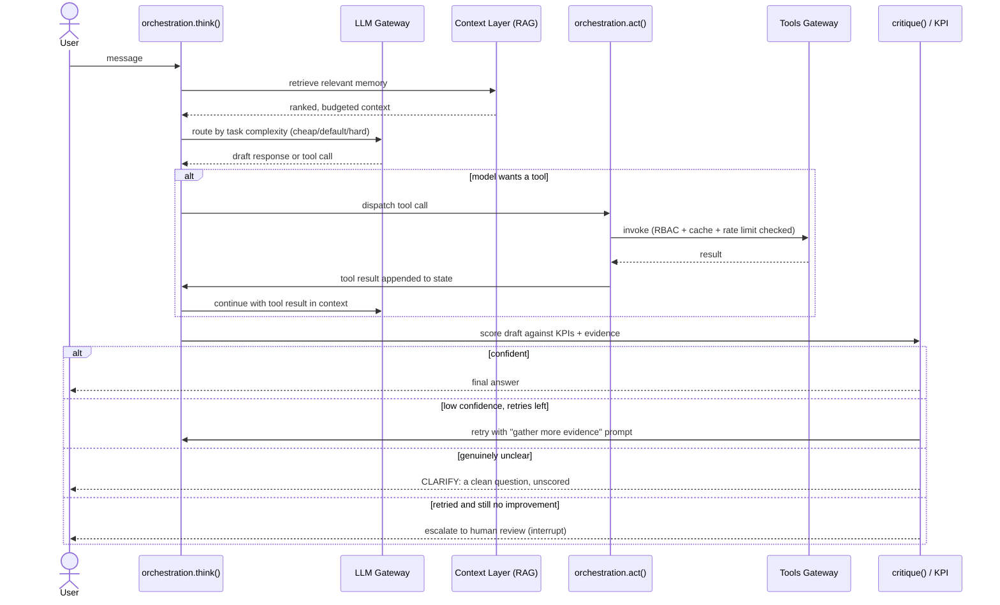

# Agent Foundry

Built by **Arghya Mukherjee**, CTO at Algonomy — a reference architecture for
taking a 0-to-1 startup from idea to a production-grade agentic product fast,
without re-deriving the governance, memory, and multi-agent primitives from
scratch each time.

A modular, SOTA-2026 framework for building governed LLM agents on
[LangGraph](https://github.com/langchain-ai/langgraph)/[LangChain](https://github.com/langchain-ai/langchain). Every layer — model routing, tools,
memory, budgets, guardrails, eval, observability — is a slot you fill with
your own implementation or one of the ones shipped here. Nothing about the
core primitives assumes a single fixed agent shape: one agent, a supervisor
of specialists, a swarm, a debate, a blackboard, or a DAG of steps are all
the same `think`/`act` building blocks wired differently.

## Why this helps a 0-to-1 startup

The stuff that normally gets skipped under startup time pressure — and then
costs a rewrite once a customer actually needs it — is already here, so the
skip never has to happen:

- **Week 1**: `python -m agent_foundry.scaffold` gets a runnable agent with
  tools, guardrails, and tracing already wired — fill in the prompt and tool
  bodies, not the plumbing. A week of infra work becomes an afternoon.
- **First paying customer**: RBAC (`Policy.allowed_tools`), fail-closed cost
  budgets, and an audit trail are already there — a security questionnaire
  doesn't send you scrambling to retrofit access controls under deadline.
- **First bad answer in front of a customer**: the critique loop already
  retries with more evidence, asks a clarifying question instead of guessing,
  and only escalates to a human when retrying genuinely didn't help — not a
  raw LLM call with no safety net.
- **Product grows past one agent**: swap `build_agent_graph` for
  `build_supervisor_graph` (or swarm/debate/DAG) — same `AgentConfig`s, same
  tools, no rewrite, because you were never on a bespoke single-agent script.
- **You need to prove it's improving**: `experiments.py`/`kpi.py` give real
  A/B variant assignment and scored metrics from day one, instead of "we
  think the new prompt is better."

## Two entry points, by how much governance you need

- **`quickstart.plug_and_play_agent`** — a junior developer's whole agent in
  ~5 lines, built on real `langchain.agents.create_agent`. No `ToolSpec`, no
  JSON schema — plain Python functions with type hints and a docstring.
- **`orchestration.build_agent_graph`** — the governed path: RBAC, guardrails,
  eval, cost/audit, autonomy levels, retry-with-more-evidence, human-in-the-loop
  escalation, multi-agent topologies. `quickstart.to_langchain_tool()` bridges
  a tool already registered in a governed `ToolRegistry` back into the simple
  path, so a team can start on the left and grow into the right without
  rewriting tools.

See `examples/support_agent.py` for a complete agent built from these pieces,
and `PLAN.md`/`docs/ARCHITECTURE.md` for the full design rationale.

## Architecture

```mermaid
flowchart TD
    User["Client / End User"]

    subgraph Entry["Entry Points"]
        Quick["quickstart.py\nplug_and_play_agent()"]
        Serve["serve.py\nFastAPI + browser chat UI + HITL"]
        Channels["channels.py\nSlack / SMS / email / any surface"]
        A2A["a2a_bridge.py\nAgent2Agent protocol"]
    end

    subgraph Loop["orchestration.py — the agent loop (LangGraph StateGraph)"]
        direction LR
        Think["think()\nprompt + context -> LLM"] --> Act["act()\ntool calls, RBAC-checked"]
        Act --> Think
        Think --> SelfVerify["self_verify()\noptional revise pass"]
        SelfVerify --> Critique["critique()\nKPI-scored gate"]
        Critique -- "below threshold,\nretries left" --> Think
        Critique -- "CLARIFY:" --> Question(["ask the user\ninstead of guessing"])
        Critique -- "no improvement,\nescalate_threshold" --> HITL(["human-in-the-loop\ninterrupt()"])
        Critique -- passes --> Final(["final answer"])
    end

    subgraph Model["LLM Gateway — Layer 05"]
        LLMG["llm_gateway.py\ntask -> model routing (cheap/default/hard)\nprovider failover, cost metering, prompt cache"]
    end

    subgraph Tool["Tools Gateway — Layer 04"]
        ToolsG["tools_gateway.py\nregistry, RBAC scopes,\nresult cache, rate limiter,\nidempotency store"]
        MCP["mcp_tools.py — any MCP server"]
        HTTP["http_tools.py — any REST API"]
        AutoGen["autogen_bridge.py — AutoGen agent as a tool"]
        DataConn["data_connectors.py — SQL / warehouses"]
    end

    subgraph Context["Context Layer — Layer 06"]
        Mem["context.py\nworking / episodic / semantic (RAG) /\nprocedural memory + knowledge graph +\nuser & org profiles"]
    end

    subgraph Runtime["Harness / Runtime — Layer 03"]
        RT["runtime.py\nRunBudget · LatencyBudget ·\nCircuitBreaker · RateLimiter · SLATracker\n(all behind swappable *Like Protocols)"]
    end

    subgraph Governance["Guardrails & Security"]
        GR["guardrails.py — input/output/action gates"]
        Sec["security.py — signed tool manifests,\negress allowlist, audit trail"]
        Policy["policy_engine.py — OPA/Rego policy-as-code"]
        Escalation["escalation.py — auto-approve / deny / escalate"]
        Sandbox["sandbox.py — restricted-namespace code execution"]
    end

    subgraph Measure["Eval, Observability & Optimization"]
        KPI["kpi.py — composable scoring functions"]
        Eval["eval.py — atomic / component / flow / overall"]
        Obs["observability.py — tracing, cost ledger, SLA dashboards"]
        Bench["benchmark.py — regression suite against a compiled graph"]
        Exp["experiments.py — A/B variant assignment + metrics"]
        Flags["feature_flags.py — on/off & % rollout"]
        Reinforce["reinforcement.py — eval signal -> prompt/policy/model"]
        Plan["planning.py — Objectives scored against KPIs"]
    end

    subgraph Cross["Cross-cutting"]
        Events["events.py — pub/sub event bus"]
        Blackboard["blackboard.py — shared multi-agent workspace"]
        Version["versioning.py — rollback for prompts/policy docs"]
        I18n["i18n.py — locale-aware prompts & formatting"]
        Batch["batch.py — batch & scheduled runs"]
        Scaffold["scaffold.py — generate a new agent's starting files"]
        Contracts["contracts.py — Identity, Policy, ToolSpec, LLMResponse…\nthe types every layer plugs into"]
    end

    User --> Quick & Serve & Channels & A2A --> Loop
    Think --> LLMG
    Act --> ToolsG
    ToolsG --> MCP & HTTP & AutoGen & DataConn
    Think --> Mem
    Loop --> RT
    Act --> GR
    Act --> Sec
    GR --> Policy
    Act -. "requires_approval" .-> Escalation
    ToolsG -. "sandboxed tools" .-> Sandbox
    Critique --> KPI --> Eval
    Loop --> Obs
    Loop -. "variant_assignment" .-> Exp
    Loop -. "gated behavior" .-> Flags
    Eval -. "closes the loop" .-> Reinforce
    Reinforce -. "scored against" .-> Plan
    Loop --> Events
    Loop -. "multi-agent" .-> Blackboard
    Contracts -.-> Loop
    Contracts -.-> ToolsG
    Contracts -.-> Mem
```



### The think → act → critique loop, in one picture



High-definition JPG exports of both diagrams (and their `.mmd` source) live in
[`docs/diagrams/`](docs/diagrams/) — useful for slides or docs that can't
render Mermaid.

## Module reference

| Module | Layer / role |
|---|---|
| `contracts.py` | Core types every layer plugs into: `Identity`, `Policy`, `ToolSpec`, `LLMResponse`, `AgentRole` |
| `orchestration.py` | **Layer 02** — the LangGraph think/act/critique loop; `build_agent_graph`, `build_supervisor_graph`, `build_swarm_graph`, `build_fanout_graph`, `build_blackboard_graph`, `build_debate_graph`, `build_dag_graph` |
| `runtime.py` | **Layer 03** — `RunBudget`, `LatencyBudget`, `CircuitBreaker`, `RateLimiter`, `SLATracker`, each behind a swappable `*Like` Protocol for fleet-wide (multi-replica) backing |
| `tools_gateway.py` | **Layer 04** — `ToolRegistry`: RBAC-scoped invocation, `ToolCache`, idempotency store |
| `llm_gateway.py` | **Layer 05** — `LLMGateway`: task→model routing (cheap/default/hard), provider failover, cost metering, prompt cache |
| `context.py` | **Layer 06** — `MemoryStore`: working/episodic/semantic (RAG)/procedural memory, `KnowledgeGraph`, user/org profiles |
| `guardrails.py` | Input/output/action gates (regex/heuristic, zero extra dependencies) |
| `security.py` | Signed tool manifests, egress allowlisting, audit trail (`AuditLog`, `EncryptedJSONLAuditLog`) |
| `policy_engine.py` | Real policy-as-code via OPA/Rego, alongside or instead of `Policy` |
| `escalation.py` | The third outcome besides auto-approve/deny |
| `sandbox.py` | Restricted-builtins, wall-clock-timeout execution for untrusted code |
| `kpi.py` | Composable scoring functions — the general mechanism guardrails/eval/planning all build on |
| `eval.py` | Atomic / component / flow / overall evaluation levels |
| `observability.py` | Tracing (`Tracer`/`OTelTracer`), `CostLedger`, alerting, dashboards |
| `benchmark.py` | Regression suite runner against any compiled graph |
| `experiments.py` | Deterministic A/B variant assignment + per-variant metrics |
| `feature_flags.py` | On/off and percentage-rollout switches |
| `reinforcement.py` | Closes eval signal back into prompt/policy/model |
| `planning.py` | `Objectives` scored against whatever KPIs are registered |
| `events.py` | Pub/sub event bus for async/cross-agent events |
| `blackboard.py` | Shared reasoning workspace for multi-agent graphs |
| `mcp_tools.py` | MCP client bridge — any stdio/HTTP MCP server becomes registry tools |
| `http_tools.py` | Wraps any REST endpoint as a `ToolSpec` |
| `data_connectors.py` | Structured data sources (SQL, warehouses) — distinct from `context.py`'s unstructured RAG |
| `a2a_bridge.py` | Makes an agent discoverable/callable over the open A2A protocol |
| `autogen_bridge.py` | A Microsoft AutoGen agent as a single tool call |
| `serve.py` | Minimal FastAPI wrapper: browser chat UI + human-in-the-loop approval |
| `channels.py` | Connects any external messaging surface to a compiled graph |
| `versioning.py` | Rollback for prompts/policy documents |
| `i18n.py` | Locale-aware prompt variants and response formatting |
| `batch.py` | Batch & scheduled runs, distinct from `orchestration.build_fanout_graph`'s in-turn parallelism |
| `scaffold.py` | Generates a new agent's starting files in seconds |
| `quickstart.py` | The plug-and-play entry point on real LangChain primitives |

## Building your own agent

There are three ways in, in increasing order of governance. Pick the one that
matches what you're building — you can start on the left and grow into the
right without rewriting your tools (`quickstart.to_langchain_tool()` bridges
a governed `ToolRegistry` tool back into the simple path).

### 1. Scaffold it (fastest way to a runnable file)

```bash
python -m agent_foundry.scaffold sales_agent --tools lookup_lead,send_email
```

Writes `prompts/sales_agent.md` and `agents/sales_agent.py` — a runnable
script with gateways, guardrails, eval, runtime and tracer already wired.
The only TODOs left are the prompt's content and each tool function's body:

```bash
export ANTHROPIC_API_KEY=...
python agents/sales_agent.py
```

### 2. `quickstart.py` (a few lines, real LangChain tool-calling)

No `ToolSpec`, no JSON schema — plain Python functions, type hints and a
docstring become the tool's schema automatically:

```bash
pip install -r requirements.txt
export ANTHROPIC_API_KEY=...
python examples/support_agent.py
```

```python
from agent_foundry.quickstart import plug_and_play_agent
from langchain_anthropic import ChatAnthropic

def lookup_order(order_id: str) -> str:
    """Look up the status of an order by its id."""
    return db.get(order_id)

agent = plug_and_play_agent(
    ChatAnthropic(model="claude-sonnet-5"),
    tools=[lookup_order],
    system_prompt="You are a support agent.",
)
agent.invoke({"messages": [{"role": "user", "content": "status of order A100?"}]}, config)
```

### 3. The governed path — `orchestration.build_agent_graph` (full control)

This is what `examples/support_agent.py` and `scaffold.py`'s generated file
both build on. Five real steps, each backed by a real module above:

```python
from agent_foundry.contracts import Identity, Policy, ToolSpec
from agent_foundry.tools_gateway import ToolRegistry
from agent_foundry.llm_gateway import LLMGateway, AnthropicProvider
from agent_foundry.runtime import RunBudget
from agent_foundry.observability import Tracer
from agent_foundry.guardrails import GuardrailEngine
from agent_foundry.orchestration import build_agent_graph

# 1. Who's calling, and what are they allowed to do (contracts.py)
identity = Identity(id="sales-agent-1", tenant_id="acme")
policy = Policy(allowed_tools=frozenset({"lookup_lead"}), max_cost_usd_per_thread=0.50, max_steps_per_thread=10)

# 2. Register real tools behind RBAC (tools_gateway.py)
tools = ToolRegistry()
tools.register(ToolSpec("lookup_lead", "Look up a sales lead", {"lead_id": "string"}, lookup_lead))

# 3. Wire the model, budget and guardrails (llm_gateway.py, runtime.py, guardrails.py)
llm = LLMGateway(provider=AnthropicProvider())
budget = RunBudget(policy)
guardrails = GuardrailEngine(policy)

# 4. (optional) memory/RAG, critique-and-retry, cross-session profiles —
#    see context.py's MemoryStore and orchestration.py's CritiqueConfig

# 5. Compile the graph — this one call is the whole think/act/critique loop
graph = build_agent_graph(
    system_prompt="You are a sales agent...",
    llm=llm, tools=tools, guardrails=guardrails, identity=identity,
    policy=policy, budget=budget, tracer=Tracer("thread-1"),
    eval_harness=EvalHarness(),
)

state = graph.invoke(
    {"messages": [{"role": "user", "content": "any updates on lead L200?"}], "thread_id": "thread-1"},
    {"configurable": {"thread_id": "thread-1"}},
)
```

Then pick a topology for how multiple agents (if any) cooperate — all built
from the exact same `AgentConfig`/`think`/`act` primitives:

| Builder | Shape | Use it when |
|---|---|---|
| `build_agent_graph` | One agent, one think/act loop | The default — most agents need exactly this |
| `build_supervisor_graph` | One router LLM picks a named specialist per turn | Different specialists (billing, tech, sales) with different tools/policy |
| `build_swarm_graph` | No central router — specialists hand off directly to a named peer | Decentralized handoffs, no single dispatcher |
| `build_fanout_graph` | One config, parallel branches in a single turn | Fan out sub-tasks and merge results in-turn |
| `build_blackboard_graph` | Agents read/write a shared workspace over N rounds | Iterative, shared-context collaboration |
| `build_debate_graph` | N debaters + a judge | Adversarial verification, higher-stakes answers |
| `build_dag_graph` | A fixed sequence of steps | A pipeline where the order is known upfront, not decided by an LLM |

Every builder accepts a real `checkpointer` (`SqliteSaver`/`PostgresSaver`)
for restart-durable sessions — see `orchestration.py`'s module docstring.

Serve any compiled graph over HTTP with a real browser chat UI:

```bash
python examples/serve_http.py
```

Or containerize it — nothing in `agent_foundry/` imports a cloud-specific SDK,
so this runs on ECS/Fargate, Cloud Run, Azure Container Apps, any Kubernetes,
or a bare VM:

```bash
docker build -t agent-foundry .
docker run -p 8080:8080 -e ANTHROPIC_API_KEY=... agent-foundry
```

## Testing

```bash
pip install -r requirements.txt -r requirements-test.txt
pytest
```

## Docs

- `docs/ARCHITECTURE.md` — full design rationale
- `docs/IMPLEMENTATION_GUIDE.md` — step-by-step build guide
- `docs/OWASP_LLM_TOP10.md` — how each OWASP LLM Top 10 risk is addressed
- `docs/BACKUP_DR.md` — what state needs backing up and how, per deployment
