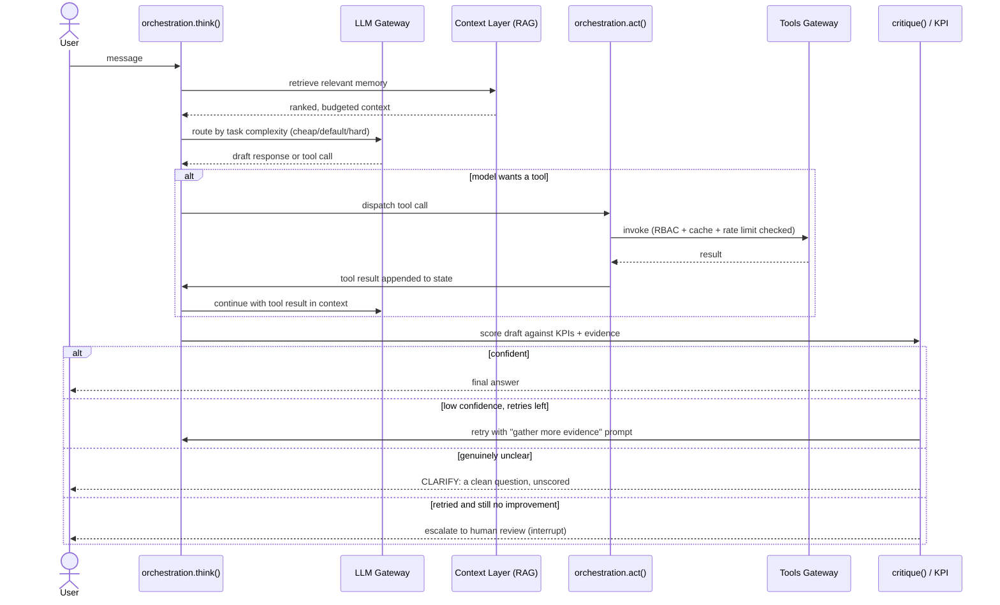
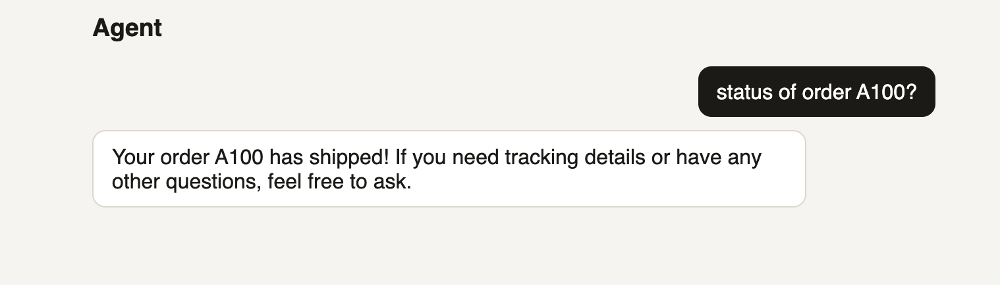

# Agent Foundry

Built by **Arghya Mukherjee**, CTO at Algonomy — a reference architecture for
taking a 0-to-1 startup from idea to a production-grade agentic product fast,
without re-deriving the governance, memory, and multi-agent primitives from
scratch each time.

A modular, SOTA-2026 framework for building governed LLM agents on
[LangGraph](https://github.com/langchain-ai/langgraph)/[LangChain](https://github.com/langchain-ai/langchain). Every layer — model routing, tools,
memory, budgets, guardrails, eval, observability — is a slot you fill with
your own implementation or one of the ones shipped here. Nothing about the
core primitives assumes a single fixed agent shape: one agent, a supervisor
of specialists, a swarm, a debate, a blackboard, or a DAG of steps are all
the same `think`/`act` building blocks wired differently.

> **34 modules** · **7 multi-agent topologies** on one shared core · **209
> tests passing** · MCP / A2A / AutoGen protocol interop built in

**Jump to:** [Why this helps a startup](#why-this-helps-a-0-to-1-startup) ·
[Architecture](#architecture) ·
[Problem → solution table](#problem--platform-service--what-solves-it-here) ·
[Module reference](#module-reference) ·
[Build your own agent](#building-your-own-agent) ·
[Testing](#testing) · [Docs](#docs)

## Why this helps a 0-to-1 startup

The stuff that normally gets skipped under startup time pressure — and then
costs a rewrite once a customer actually needs it — is already here, so the
skip never has to happen:

- **Week 1**: `python -m agent_foundry.scaffold` gets a runnable agent with
  tools, guardrails, and tracing already wired — fill in the prompt and tool
  bodies, not the plumbing. A week of infra work becomes an afternoon.
- **First paying customer**: RBAC (`Policy.allowed_tools`), fail-closed cost
  budgets, and an audit trail are already there — a security questionnaire
  doesn't send you scrambling to retrofit access controls under deadline.
- **First bad answer in front of a customer**: the critique loop already
  retries with more evidence, asks a clarifying question instead of guessing,
  and only escalates to a human when retrying genuinely didn't help — not a
  raw LLM call with no safety net.
- **Product grows past one agent**: swap `build_agent_graph` for
  `build_supervisor_graph` (or swarm/debate/DAG) — same `AgentConfig`s, same
  tools, no rewrite, because you were never on a bespoke single-agent script.
- **You need to prove it's improving**: `experiments.py`/`kpi.py` give real
  A/B variant assignment and scored metrics from day one, instead of "we
  think the new prompt is better."

## Two entry points, by how much governance you need

- **`quickstart.plug_and_play_agent`** — a junior developer's whole agent in
  ~5 lines, built on real `langchain.agents.create_agent`. No `ToolSpec`, no
  JSON schema — plain Python functions with type hints and a docstring.
- **`orchestration.build_agent_graph`** — the governed path: RBAC, guardrails,
  eval, cost/audit, autonomy levels, retry-with-more-evidence, human-in-the-loop
  escalation, multi-agent topologies. `quickstart.to_langchain_tool()` bridges
  a tool already registered in a governed `ToolRegistry` back into the simple
  path, so a team can start on the left and grow into the right without
  rewriting tools.

See `examples/support_agent.py` for a complete agent built from these pieces,
and `PLAN.md`/`docs/ARCHITECTURE.md` for the full design rationale.

## Architecture


### The think → act → critique loop, in one picture



High-definition JPG exports of both diagrams (and their `.mmd` source) live in
[`docs/diagrams/`](docs/diagrams/) — useful for slides or docs that can't
render Mermaid.

## Problem → platform service → what solves it here

Every one of these is a named platform-service concern any production agent
eventually needs — the third column is what actually implements it in this
repo, not just the concept:

| Problem | Platform service | Solved by (this repo) |
|---|---|---|
| No memory between messages | Session Service | `orchestration.py` — `AgentState` + a real `checkpointer` (`MemorySaver`/`SqliteSaver`/`PostgresSaver`) |
| Forgets across sessions | Session Service (memory layer) | `context.py` — `MemoryStore.profiles`, loaded via `AgentConfig.user_id` every turn regardless of thread |
| Hallucinates organizational facts | Data Service (RAG) | `context.py` — semantic memory (RAG) + `ContextEngine`; `data_connectors.py` for structured sources |
| Cannot take actions | Tool Service + MCP | `tools_gateway.py` — RBAC-scoped `ToolRegistry`; `mcp_tools.py` bridges any MCP server in |
| Unsafe actions and responses | Guardrails Service | `guardrails.py` (input/output/action gates) + `security.py` (signed manifests, audit) + `policy_engine.py` (OPA/Rego) |
| Cannot see what happened | Observability Service | `observability.py` — tracing, `CostLedger`, SLA dashboards |
| Cannot measure improvement | Experimentation Service | `experiments.py` (A/B variant assignment) + `kpi.py` + `eval.py` (atomic/component/flow/overall) |
| Cannot deploy and scale | Workflow Service | `serve.py` + `Dockerfile` (any cloud that runs a container) + `runtime.py`'s `*Like` Protocols (swap in fleet-shared budget/cache/rate-limiter) |
| Model vendor lock-in | Model Service | `llm_gateway.py` — `Provider` protocol, task→model routing, provider failover |

## Module reference

34 modules, grouped the same way as the architecture diagram above. Every
"Provides" entry is a real class or function actually defined in that file.

### Foundation

| Module | Provides | For |
|---|---|---|
| `contracts.py` | `Identity`, `Policy`, `ToolSpec`, `ToolResult`, `ToolCall`, `LLMResponse`, `AgentRole`, `AutonomyLevel` | The types every other layer plugs into — read this file first |
| `prompts.py` | `PromptLibrary`, `VersionedPromptLibrary`, `load_prompt()` | Loads prompts as plain text/markdown files, not Python string literals |

### Core loop — Layer 02

| Module | Provides | For |
|---|---|---|
| `orchestration.py` | `AgentConfig`, `CritiqueConfig`, `AgentState`, `make_think_node`, `make_act_node`, `make_critique_node`, `make_self_verify_node`, and all 7 `build_*_graph` topology builders | The think/act/critique loop itself — everything else in this repo is a slot it calls into |

### Runtime, tools & model — Layers 03–05

| Module | Provides | For |
|---|---|---|
| `runtime.py` | `RunBudget`, `LatencyBudget`, `CircuitBreaker`, `RateLimiter`, `SLATracker` — each with a swappable `*Like` Protocol | Per-thread cost/step/latency budgets, retries, circuit breaking |
| `tools_gateway.py` | `ToolRegistry`, `ToolCache`, `InMemoryIdempotencyStore`, `tool_json_schema` | RBAC-scoped tool invocation, result caching, idempotency |
| `mcp_tools.py` | `MCPToolSource` | Any stdio/HTTP MCP server's tools, registered into a `ToolRegistry` |
| `http_tools.py` | `http_tool()` | Wraps any REST endpoint as a `ToolSpec`, no MCP server needed |
| `autogen_bridge.py` | `autogen_as_tool()` | A Microsoft AutoGen agent as a single tool call |
| `data_connectors.py` | `DataSource` (Protocol), `SQLiteDataSource`, `data_query_tool()` | Structured data (SQL, warehouses) — distinct from `context.py`'s unstructured RAG |
| `llm_gateway.py` | `LLMGateway`, `AnthropicProvider`, `OpenAIProvider`, `MultiProvider`, `PromptCache`, `ModelRegistry`, `make_llm_judge()` | Task→model routing (cheap/default/hard), provider failover, cost metering |

### Context Layer — Layer 06

| Module | Provides | For |
|---|---|---|
| `context.py` | `VectorStore` (Protocol), `InMemoryVectorStore`, `ChromaVectorStore`, `KnowledgeGraphStore`, `ProceduralMemory`, `retrieval_tool()`, `memory_write_tool()`, `profile_write_tool()` | Working/episodic/semantic (RAG)/procedural memory, knowledge graph, cross-session profiles |

### Guardrails & security

| Module | Provides | For |
|---|---|---|
| `guardrails.py` | `GuardrailEngine`, `LLMGuardrails`, `redact()`, `looks_like_injection()` | Input/output/action gates — regex/heuristic by default, LLM-based via `LLMGuardrails` |
| `security.py` | `ToolManifestRegistry`, `EgressPolicy`, `CredentialVault`, `VaultCredentialProvider`, `AuditLog`, `EncryptedJSONLAuditLog` | Signed tool manifests, egress allowlisting, encrypted audit trail |
| `policy_engine.py` | `OPAPolicyEngine`, `CedarPolicyEngine` | Real policy-as-code (Rego or Cedar), alongside or instead of `Policy` |
| `escalation.py` | `EscalationTicket`, `QueueEscalator` | The third outcome besides auto-approve/deny |
| `sandbox.py` | `run_sandboxed()`, `code_execution_tool()` | Restricted-builtins, wall-clock-timeout execution for untrusted code |

### Eval, observability & optimization

| Module | Provides | For |
|---|---|---|
| `kpi.py` | `KPI`, `KPIBoard`, `KPIResult`, `efficiency_kpi()`, `conciseness_kpi()`, `policy_adherence_kpi()`, `word_overlap()` | Composable scoring functions guardrails/eval/planning all build on |
| `eval.py` | `EvalHarness`, `JSONLEvalSink` | Atomic / component / flow / overall evaluation levels |
| `observability.py` | `Tracer`, `OTelTracer`, `Metrics`, `CostLedger`, `check_alerts()` | Tracing, cost ledger, alerting, dashboards |
| `benchmark.py` | `BenchmarkCase`, `CaseResult`, `BenchmarkReport`, `run_benchmark()` | Regression suite against any compiled graph |
| `experiments.py` | `Experiment`, `ExperimentTracker` | Deterministic A/B variant assignment + per-variant metrics |
| `feature_flags.py` | `FeatureFlagProvider` (Protocol), `StaticFeatureFlagProvider` | On/off and percentage-rollout switches |
| `reinforcement.py` | `PromptOptimizer`, `PreferenceStore` | Closes eval signal back into prompt/policy/model |
| `planning.py` | `Objective`, `Planner`, `StrategySelector`, `BanditSelector` | `Objectives` scored against whatever KPIs are registered |

### Integration & cross-cutting

| Module | Provides | For |
|---|---|---|
| `events.py` | `EventBus` (Protocol), `InMemoryEventBus`, `KafkaEventBus`, `wire_event_driven()` | Pub/sub for async/cross-agent events |
| `blackboard.py` | `Blackboard`, `parse_post()` | Shared reasoning workspace for multi-agent graphs |
| `a2a_bridge.py` | `agent_card_for()`, `build_a2a_app()` | Makes an agent discoverable/callable over the open A2A protocol |
| `serve.py` | `build_http_app()`, `invoke_graph_chat_turn()` | Minimal FastAPI wrapper: browser chat UI + human-in-the-loop approval |
| `channels.py` | `build_slack_app()`, `verify_slack_signature()` | Connects an external messaging surface (Slack, etc.) to a compiled graph |
| `versioning.py` | `VersionStore` (Protocol), `FileVersionStore` | Rollback for prompts/policy documents |
| `i18n.py` | `LocaleSpec`, `register_locale()`, `format_currency()`, `format_date()` | Locale-aware prompt variants and response formatting |
| `batch.py` | `Scheduler` (Protocol), `IntervalScheduler`, `run_batch()`, `BatchReport` | Batch & scheduled runs — distinct from `build_fanout_graph`'s in-turn parallelism |
| `scaffold.py` | CLI: `python -m agent_foundry.scaffold` | Generates a new agent's starting files in seconds |
| `quickstart.py` | `plug_and_play_agent()`, `to_langchain_tool()` | The plug-and-play entry point on real LangChain primitives |

## Building your own agent

There are three ways in, in increasing order of governance. Pick the one that
matches what you're building — you can start on the left and grow into the
right without rewriting your tools (`quickstart.to_langchain_tool()` bridges
a governed `ToolRegistry` tool back into the simple path).

### 1. Scaffold it (fastest way to a runnable file)

```bash
python -m agent_foundry.scaffold sales_agent --tools lookup_lead,send_email
```

Writes `prompts/sales_agent.md` and `agents/sales_agent.py` — a runnable
script with gateways, guardrails, eval, runtime and tracer already wired.
The only TODOs left are the prompt's content and each tool function's body:

```bash
export ANTHROPIC_API_KEY=...
python agents/sales_agent.py
```

### 2. `quickstart.py` (a few lines, real LangChain tool-calling)

No `ToolSpec`, no JSON schema — plain Python functions, type hints and a
docstring become the tool's schema automatically:

```bash
pip install -r requirements.txt
export ANTHROPIC_API_KEY=...
python examples/support_agent.py
```

```python
from agent_foundry.quickstart import plug_and_play_agent
from langchain_anthropic import ChatAnthropic

def lookup_order(order_id: str) -> str:
    """Look up the status of an order by its id."""
    return db.get(order_id)

agent = plug_and_play_agent(
    ChatAnthropic(model="claude-sonnet-5"),
    tools=[lookup_order],
    system_prompt="You are a support agent.",
)
agent.invoke({"messages": [{"role": "user", "content": "status of order A100?"}]}, config)
```

### 3. The governed path — `orchestration.build_agent_graph` (full control)

This is what `examples/support_agent.py` and `scaffold.py`'s generated file
both build on. Five real steps, each backed by a real module above:

```python
from agent_foundry.contracts import Identity, Policy, ToolSpec
from agent_foundry.tools_gateway import ToolRegistry
from agent_foundry.llm_gateway import LLMGateway, AnthropicProvider
from agent_foundry.runtime import RunBudget
from agent_foundry.observability import Tracer
from agent_foundry.guardrails import GuardrailEngine
from agent_foundry.orchestration import build_agent_graph

# 1. Who's calling, and what are they allowed to do (contracts.py)
identity = Identity(id="sales-agent-1", tenant_id="acme")
policy = Policy(allowed_tools=frozenset({"lookup_lead"}), max_cost_usd_per_thread=0.50, max_steps_per_thread=10)

# 2. Register real tools behind RBAC (tools_gateway.py)
tools = ToolRegistry()
tools.register(ToolSpec("lookup_lead", "Look up a sales lead", {"lead_id": "string"}, lookup_lead))

# 3. Wire the model, budget and guardrails (llm_gateway.py, runtime.py, guardrails.py)
llm = LLMGateway(provider=AnthropicProvider())
budget = RunBudget(policy)
guardrails = GuardrailEngine(policy)

# 4. (optional) memory/RAG, critique-and-retry, cross-session profiles —
#    see context.py's MemoryStore and orchestration.py's CritiqueConfig

# 5. Compile the graph — this one call is the whole think/act/critique loop
graph = build_agent_graph(
    system_prompt="You are a sales agent...",
    llm=llm, tools=tools, guardrails=guardrails, identity=identity,
    policy=policy, budget=budget, tracer=Tracer("thread-1"),
    eval_harness=EvalHarness(),
)

state = graph.invoke(
    {"messages": [{"role": "user", "content": "any updates on lead L200?"}], "thread_id": "thread-1"},
    {"configurable": {"thread_id": "thread-1"}},
)
```

Then pick a topology for how multiple agents (if any) cooperate — all built
from the exact same `AgentConfig`/`think`/`act` primitives:

| Builder | Shape | Use it when |
|---|---|---|
| `build_agent_graph` | One agent, one think/act loop | The default — most agents need exactly this |
| `build_supervisor_graph` | One router LLM picks a named specialist per turn | Different specialists (billing, tech, sales) with different tools/policy |
| `build_swarm_graph` | No central router — specialists hand off directly to a named peer | Decentralized handoffs, no single dispatcher |
| `build_fanout_graph` | One config, parallel branches in a single turn | Fan out sub-tasks and merge results in-turn |
| `build_blackboard_graph` | Agents read/write a shared workspace over N rounds | Iterative, shared-context collaboration |
| `build_debate_graph` | N debaters + a judge | Adversarial verification, higher-stakes answers |
| `build_dag_graph` | A fixed sequence of steps | A pipeline where the order is known upfront, not decided by an LLM |

Every builder accepts a real `checkpointer` (`SqliteSaver`/`PostgresSaver`)
for restart-durable sessions — see `orchestration.py`'s module docstring.

### 4. UI/UX — a minimal reference chat UI, not a polished product

`serve.py`'s `build_http_app` serves any compiled graph behind a real browser
chat UI at `GET /`, with human-in-the-loop approval wired to `POST /resume`.
It's intentionally bare — a title, a message list, and an input box — because
its job is proving the API works end to end, not being a product frontend:

```bash
python examples/serve_http.py
```



For an actual product UI, build your own against `POST /chat` (and
`POST /resume` for approvals) — this reference page is meant to be replaced,
not polished. `channels.py` covers the other direction: wiring the same
compiled graph into an existing surface (Slack, SMS, email) instead of a
custom web frontend.

Or containerize it — nothing in `agent_foundry/` imports a cloud-specific SDK,
so this runs on ECS/Fargate, Cloud Run, Azure Container Apps, any Kubernetes,
or a bare VM:

```bash
docker build -t agent-foundry .
docker run -p 8080:8080 -e ANTHROPIC_API_KEY=... agent-foundry
```

**Portable ≠ horizontally scalable out of the box**, and it's worth being
precise about which one you're getting for free. The container itself is
genuinely cloud-agnostic — no SDK lock-in, runs anywhere a container runs.
But the *defaults* (`MemorySaver` checkpointer, in-process `RunBudget`,
`RateLimiter`, `ToolCache`, `CostLedger`, `SLATracker`) live in one process's
memory, so two replicas of this container don't share session state,
budgets, or rate limits — each enforces its own copy, N times over across N
replicas. Going from one process to a real fleet means backing those with
something shared (Postgres/Redis) instead of the in-process default — every
one of them is already behind a `*Like` Protocol in `runtime.py`/
`tools_gateway.py`/`observability.py` specifically so that swap is a
constructor argument, not a rewrite. See `docs/BACKUP_DR.md` for what state
needs backing up and how, per deployment shape.

## Testing

```bash
pip install -r requirements.txt -r requirements-test.txt
pytest
```

## Docs

- `docs/ARCHITECTURE.md` — full design rationale
- `docs/IMPLEMENTATION_GUIDE.md` — step-by-step build guide
- `docs/OWASP_LLM_TOP10.md` — how each OWASP LLM Top 10 risk is addressed
- `docs/BACKUP_DR.md` — what state needs backing up and how, per deployment
