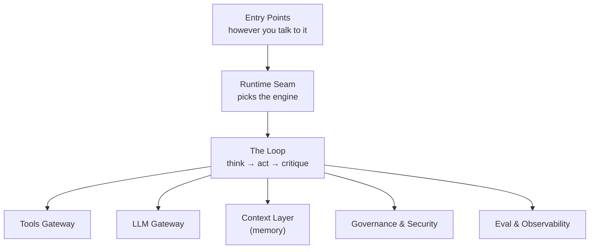
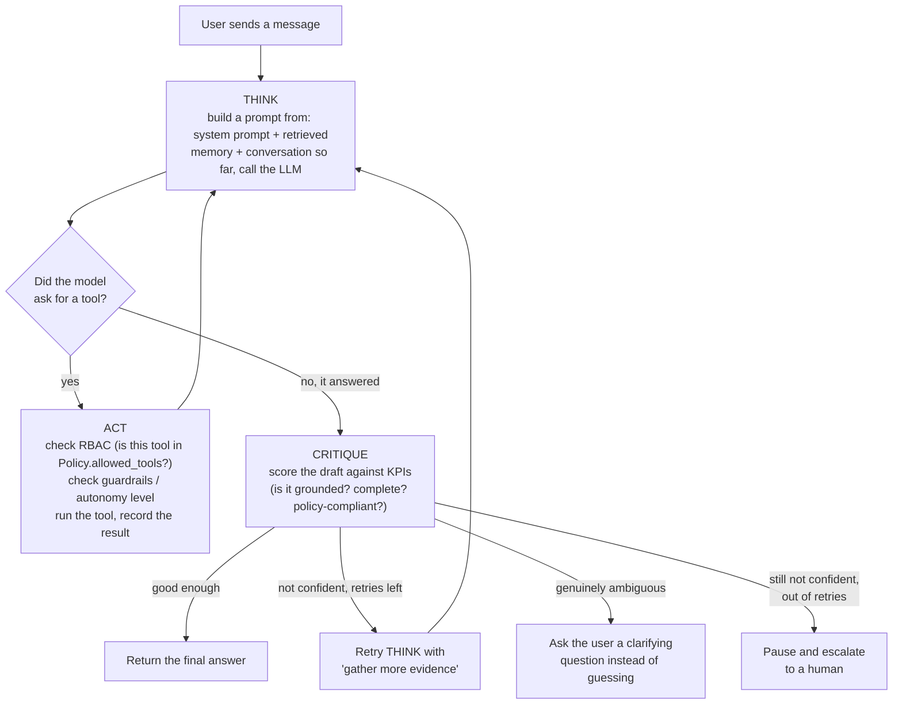
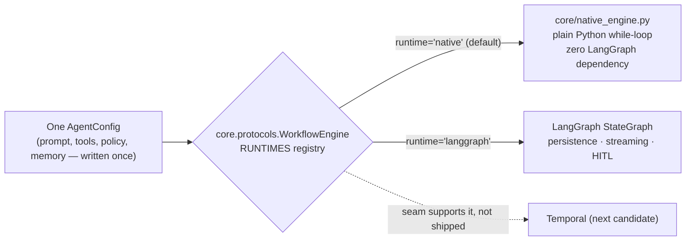

# How Agent Foundry Works

*A plain-language, full-coverage walkthrough of the whole repository — read this before `ARCHITECTURE.md` (the formal spec) or the README (the dense, fully-cited version). This document trades some precision for clarity; where it simplifies, the linked source file has the exact behavior.*

---

## 1. The one-sentence version

Agent Foundry is a **library**, not a hosted service: you write plain Python (or a YAML file), and it gives you an `Agent` object that can think, call tools, check itself before answering, and ask a human when it's unsure — with permissions, spending limits, and an audit trail built in from the start, not bolted on later.

Everything else in this document is one of three things:
- **the loop** an agent runs every turn (think → act → check itself),
- **the scaffolding** around that loop (who's allowed to do what, which tools exist, where memory lives, how you know it's working), and
- **the proof** that it actually works (546 tests across 65 files, CI, a benchmark suite, an OWASP threat-model cross-check).

---

## 2. The mental model: an employee, not a chatbot

The easiest way to hold this codebase in your head is to stop thinking "chatbot" and think **"new employee with a job description."**

| Real-world concept | Agent Foundry equivalent | File |
|---|---|---|
| The employee's job description | `instructions` (a system prompt) | `prompts.py` |
| What they're allowed to touch | `Policy` (allowed tools, spend cap, approval list) | `contracts.py` |
| Their badge / who they are | `Identity` (id, tenant, roles) | `contracts.py` |
| The tools on their desk | `ToolRegistry` (functions, MCP servers, REST APIs, SQL) | `tools_gateway.py` |
| Their notebook / CRM history | `MemoryStore` (working, episodic, semantic/RAG, profiles) | `context.py` |
| A manager who reviews risky decisions | Guardrails + human-in-the-loop approval | `guardrails.py`, `escalation.py` |
| A manager who checks their work before it goes out | The **critique** step | `orchestration.py` / `core/native_engine.py` |
| HR's record of everything that happened | `AuditLog` | `security.py` |
| The org chart, if you hire more than one employee | `Workflow` topologies (supervisor, swarm, debate, …) | `core/native_orchestration.py`, `orchestration.py` |

You build **one** `AgentConfig` (the job description + permissions + tools + memory), and that same config can be run as a solo employee, or wired into a team. Nothing about the employee changes when you put them on a team — only how turns get routed to them.

---

## 3. The whole architecture, in one picture

Zooming out before zooming in — the simplest version of the whole system, eight boxes, one flow:



Every box is a real layer, not a diagram-only concept. Layer by layer, what each one is and why it exists as its own thing rather than folded into another:

| Layer | Purpose | Key modules | Why it's a separate layer |
|---|---|---|---|
| **Entry Points** | However a request reaches an agent | `Agent` / `Workflow` (Python), `AgentSpec` (YAML/JSON), `cli.py` (`foundry` shell command), `serve.py` (HTTP chat API), `channels.py` (Slack), `a2a_bridge.py` (agent-to-agent) | Six different front doors, all building the *same* `AgentConfig` — a Slack message and a direct Python call get identical governance, not a lesser version |
| **Runtime Seam** | Picks which engine actually executes the loop | `core/protocols.py`'s `WorkflowEngine`, `core/engines.py`'s `RUNTIMES` registry | One keyword switch (`runtime=`) instead of a rewrite — a new engine (Temporal, say) registers here without `Agent` itself changing |
| **The Loop** | The actual agent behavior — this is the "intelligence" | `orchestration.py` (LangGraph path), `core/native_engine.py` (native path) | Every topology and every runtime is built from the same three primitives: think, act, critique — one loop to understand, two engines to run it |
| **Tools Gateway** | Everything an agent can *do* | `tools_gateway.py`, `mcp_tools.py`, `http_tools.py`, `crewai_bridge.py`, `autogen_bridge.py`, `data_connectors.py` | RBAC, caching, rate limiting, and idempotency happen in one place, regardless of whether the tool is a local function, an MCP server, or someone else's agent |
| **LLM Gateway** | Everything an agent *thinks with* | `llm_gateway.py` | One contract (`complete(messages, model=...)`) — no other layer imports a vendor SDK directly, so swapping or failing over models doesn't ripple upward |
| **Context Layer** | Everything an agent *remembers* | `context.py` | Working, episodic, semantic (RAG), and cross-session profile memory behind one API — kept separate from the loop so memory can be upgraded (in-memory → Chroma) without touching orchestration |
| **Governance & Security** | Who's allowed to do what, and the proof of it | `contracts.py`, `guardrails.py`, `security.py`, `escalation.py`, `policy_engine.py` | RBAC, guardrails, signed tool manifests, and an audit trail run on *every* call through the loop — load-bearing, not a wrapper that can be skipped |
| **Eval & Observability** | How you know it's actually working | `kpi.py`, `core/evalgate.py`, `observability.py`, `experiments.py` | Watches every step from the side rather than sitting in the request path — and can fail a release (§12), not just log one after the fact |

A request comes in through one of the six front doors, the runtime seam picks the engine, and the loop runs — touching tools, the model, and memory as it needs them, checked by governance at every action, watched by eval/observability the whole time.

---

## 4. The loop every agent runs: think → act → critique

This is the actual engine. Every single-agent turn — regardless of which "runtime" executes it (more on that in §5) — is this loop:



Walking it through with a concrete example (this is literally what `examples/support_agent.py` does):

1. A customer asks *"What's the status of order A100?"*
2. **Think**: the agent's system prompt + any relevant memory (nothing needed here) go to the LLM. The model decides it needs the `lookup_order` tool.
3. **Act**: before running `lookup_order`, a Policy Decision Point checks more than a simple allowlist — is `lookup_order` in this identity's `Policy.allowed_tools`? Is it flagged `requires_approval`? Does it push spend-so-far over the thread's cost cap? Does it reach an allowed host (`egress_hosts`)? (All clear.) It runs, returns `"A100: shipped, eta 2026-09-05"`. If the model asked for several tools in the same turn, the cleared ones run *concurrently*, not one at a time — the loop only serializes around an approval pause, so nothing ordered before it starts before a human sees the prompt.
4. Back to **Think**: the model now has the tool result and writes a real answer.
5. **Critique**: the answer is scored (did it actually answer the question? is it concise?). It passes, and is returned.

Now the *risky* path — *"Refund $20 for order A100"*:

1. **Think** decides to call `issue_refund`.
2. **Act** checks policy — `issue_refund` is in `requires_approval`. Instead of running it, the loop **pauses** and surfaces an approval request.
3. A human (in the CLI, the web chat UI, or a Slack thread) approves or denies it.
4. Approved → the loop **resumes** exactly where it left off, actually runs the refund, and continues to Critique → final answer. Denied → the model is told and answers accordingly.

That pause/resume mechanic is the same one used for "I'm not sure, let me ask a person" — a destructive tool call and a genuine escalation both go through the same interrupt point, just for different reasons (`Policy.requires_approval` vs. the critique step's own escalate branch).

---

## 5. Two engines run that same loop — pick one per agent, or per call

This is the single most important architectural decision in the codebase, so it's worth being very explicit about it.

**The loop above is described once, conceptually.** It is then *implemented twice*:

- **`runtime="native"`** (the default) — `core/native_engine.py`. A plain Python `while` loop. No LangGraph. No `StateGraph`. No `interrupt()`. Just dataclasses and functions. `pip install agent-foundry` with zero extras can run this.
- **`runtime="langgraph"`** (opt-in, `pip install agent-foundry[langgraph]`) — the exact same steps, but executed as nodes in a LangGraph `StateGraph`, which gives you LangGraph's own persistence/checkpointing and streaming machinery for free.



Why does this matter, practically?

- **You write your agent once.** Same prompt, same tools, same `Policy`. You choose the engine with one keyword, per-agent or per-call (`agent.run(msg, runtime="langgraph")` overrides the default for a single call).
- **It's proven interchangeable, not just parallel.** `tests/test_native_engine.py` runs the *exact same test scenarios* as `tests/test_core_agent.py` (the LangGraph path), just against the other engine — same RBAC, same budgets, same critique behavior.
- **Native is faster and lighter** — see §15 for the measured numbers.
- **LangGraph still earns its keep** for two specific things native doesn't do yet: durable checkpointing via LangGraph's own storage mechanism, and pausing mid-conversation inside a blackboard/debate hand-off (a documented, tested gap — see §16).

All **six multi-agent topologies** (§6) also run on either engine — it's not "native = single agent only."

---

## 6. When one agent isn't enough: the six topologies

`Agent` covers one employee. `Workflow` is the org chart for when you need more than one — and every shape below is built from the *same* three primitives (`think`, `act`, a router), just wired differently.

| Topology | Real-world analogy | What actually happens |
|---|---|---|
| **Supervisor** | A dispatcher routes each call to the right specialist | One LLM reads the request and picks which named agent handles it (fails *closed* — an unrecognized route retries once, then either goes to a configured `fallback_agent` or raises, rather than silently guessing) |
| **Swarm** | Peer hand-off, no manager | Any specialist can transfer the conversation directly to another peer — no central router |
| **Blackboard** | A shared whiteboard in a war room | Several agents read and write to one shared workspace (facts, hypotheses, evidence, open questions) instead of talking to each other directly |
| **Debate** | A panel + a judge | N agents answer independently; a judge agent reads all answers and synthesizes a final one |
| **Fanout** | Assign the same task to 50 people at once | One agent applied to many inputs *concurrently* (bounded — `max_concurrency`, default 32 — so you don't spin up a thread per item) |
| **DAG** | An assembly line | A fixed pipeline of deterministic steps with dependencies — for when you need reliability, not judgement, at every hop |

Every one of these is available as `Workflow.supervisor(...)`, `Workflow.swarm(...)`, etc., and every one takes the same `runtime="native"` or `runtime="langgraph"` keyword as a single `Agent`.

Two things worth knowing if you're picking a topology for something real:
- **Human-in-the-loop across a topology hop** — pausing mid-turn for approval — is solid for supervisor and swarm on both engines. For blackboard/debate it's solid on native (`core/native_orchestration.py`'s `_PausableTurns`), but a confirmed, tested gap on LangGraph (an interrupt inside one participant's turn gets silently lost). This is called out directly in the README rather than glossed over.
- Native multi-agent *topology* state (who's turn it is, a paused approval, debate round number) is **not** yet wired to a durable `StateStore`. A single agent's own conversation state *is* durable if you pass `state_store=` (in-memory, Postgres, or Redis). If the process dies mid-topology-turn, you lose that topology's position; a single agent's state survives.

---

## 7. Why these architectural choices — justified, not just described

Every major structural decision in this codebase was a trade-off, not a default. This table names each one, what was actually chosen, why, and what it costs — so the architecture reads as a set of decisions with reasons, not just a list of components.

| Decision | What was chosen | Why (the justification) | Trade-off / cost |
|---|---|---|---|
| How extension points are defined | A Python `Protocol` (structural typing) for every swappable piece — `WorkflowEngine`, `Tool`, `Memory`, `StateStore`, `GuardrailChecks`, `Evaluator`, `PolicyEngine`, `VectorStore`, and more | A replacement doesn't need to subclass anything, only match the shape — and every protocol here has **at least two real implementations proven**, not just declared possible (Anthropic + OpenAI; regex guardrails + LLM guardrails; OPA + Cedar; in-memory + Chroma) | Less compile-time enforcement than an abstract base class — conformance is structural and tested, not declared |
| How many execution engines exist, and which is default | Two — `native` (plain Python, default) and `langgraph` (opt-in) — behind one `WorkflowEngine` seam | `pip install agent-foundry` needs zero LangGraph install to run an agent; native is measurably faster and lighter (§15); LangGraph stays available for teams that specifically need its own durable checkpointing or multi-agent topology-hop HITL | Two implementations of the same loop to keep behaviorally identical — mitigated by running the *same* test scenarios against both (§11), not by inspection alone |
| How much autonomy an agent has | A graduated six-level scale (`L0`–`L5`), not a binary approve/deny | Real-world risk isn't binary — "may draft, not act" and "may act on anything policy allows" are genuinely different postures or organizations actually operate on a spectrum of delegated trust | More states to reason about than a boolean — but it maps to how a real approvals process already works, rather than forcing everything through one gate |
| How a tool call is authorized | A deterministic Policy Decision Point (allowlist, spend cap, egress hosts, requires-approval) — not "trust the model to follow its instructions" | A model can be talked out of its own instructions (prompt injection); a check enforced entirely outside the model's control can't be | Someone has to maintain the policy explicitly — it can't infer intent, only enforce what's declared |
| What guardrails run by default | Regex/heuristic pattern matching, with `LLMGuardrails` (LLM-judgment) available as an opt-in upgrade | A zero-dependency, zero-latency, zero-extra-cost baseline that works with no API key and no extra model call on every turn | Regex has real recall limits — stated plainly in the docs (§13) rather than oversold, precisely so a team knows to layer `LLMGuardrails` on top for high-stakes input |
| What happens when a budget is exceeded | Fails **closed** — raises and stops the turn — rather than silently capping and continuing | A runaway loop should stop visibly, not keep going in some degraded, unnoticed state | A legitimate long-running task can hit the ceiling and need its limit deliberately raised — that friction is the point, not a bug |
| Where evaluation sits in the lifecycle | A release gate (`core/evalgate.py`'s `.passes(thresholds)`, callable from `foundry eval` in CI), not only a post-hoc dashboard | Catches a prompt or topology regression *before* it ships, the same way a test suite catches a code regression | Needs a maintained, versioned eval dataset per agent — ongoing work, not a one-time setup cost |
| How other agent frameworks are treated | Interop bridges (MCP, A2A, CrewAI, AutoGen) — wrap their agent as one `ToolSpec`, or hand one of ours to theirs | A team already invested in CrewAI or AutoGen shouldn't have to rewrite into a new DSL just to use this framework's governance | The integration is only as deep as "callable as a tool" — not a merge of two frameworks' own state/memory models |
| How an agent can be configured | Both a Python API (`Agent(...)`) and a declarative `AgentSpec` (YAML/JSON) — same governed path either way | Lets a non-engineer change a prompt, a tool wiring, or a policy value without touching Python, while an engineer keeps full code-level control when needed | Anything needing a live Python object (a custom `KPI`, a hand-built `LLMGateway`) still needs the Python path — YAML covers the structurally-expressible common case, not everything |
| How the framework stays cloud-portable | No module in `agent_foundry/` imports a cloud-specific SDK; the container is the only portability boundary | The same image runs unmodified on AWS, GCP, Azure, any Kubernetes cluster, or a bare VM | A managed cloud service (a managed vector DB, a managed queue) has to be wired in at the deployment layer, by design — not something the framework abstracts away for you |
| How "pause for a human" is implemented | One interrupt/resume mechanism, shared by both "this tool needs approval" and "the critique step isn't confident" | Fewer moving parts to get right — a single pause/resume path serving two different triggers, instead of two mechanisms that could quietly drift apart | A caller resuming a paused turn needs to know which case it is to respond sensibly — both go through the same `resume(approved=...)` shape |
| How tool calls in one turn are dispatched | Concurrently by default, serializing only around an approval pause | Throughput — a turn calling three independent tools shouldn't pay for them one at a time | The per-turn spend-so-far check is computed once at the top of the turn rather than re-read after each call — a deliberate, documented accuracy/latency trade, not an oversight |

---

## 8. Module-by-module reference — every file, grouped by the layer it belongs to

This is the answer to "what does each piece of this codebase do, and why would I ever touch it" — organized by the same **Layer 0–5 model** built up through this document: Layer 0 is what *you* decide before anything runs; Layers 1–5 are the runtime machinery that carries it out; Guardrails/Security and Eval/Observability are cross-cutting — checked at every step, not visited in sequence.

### Layer 0 — Agentic Config & Entry Points

Everything here is decided once, by a human, before the loop ever runs — the config itself, and the different front doors a request can arrive through.

| Module | What it does | Why it matters |
|---|---|---|
| `contracts.py` | `from agent_foundry.contracts import Policy` — Defines `Identity`, `Policy`, `AutonomyLevel` (L0–L5), `ToolSpec`, `ToolResult`, `ToolCall`, `LLMResponse`, `GuardrailResult` — plain dataclasses, no logic | Read this file first — every other layer is built to plug into these exact shapes |
| `prompts.py` | `from agent_foundry.prompts import PromptLibrary` — Loads a system prompt from a plain `.md` or `.txt` file instead of a Python string literal | Keeps prompts editable by a non-engineer, versionable in git like any other content file |
| `agent_spec.py` | `from agent_foundry import AgentSpec` — `AgentSpec.from_yaml(...)` — the declarative alternative to writing Python: a YAML/JSON file describing tools, policy, and a named critique evaluator | Lets a team hand a non-Python-writing operator a config file instead of a script; `foundry run --spec` and `foundry eval` both consume it |
| `core/execution_context.py` | `from agent_foundry import ExecutionContext` — `ExecutionContext` — carries the run id, thread id, session id, user id, tenant id, permissions, and budget for one call | The one object you pass to `.run(msg, context=...)` to identify who's calling and which conversation this is |
| `core/registries.py` | `from agent_foundry import PromptRegistry` — `PromptRegistry`, `PolicyRegistry`, `EvalRegistry` — named lookup tables | Lets `Agent(instructions="support_v2", policy="strict")` resolve a name instead of importing an object directly |
| `core/tool_decorator.py` | `from agent_foundry import tool` — `@tool(...)` — a decorator that turns a plain function into a `ToolSpec` with real timeout/cache_ttl/permissions metadata | The ergonomic way to register a tool without hand-building a `ToolSpec` — still a Layer 0 decision, just a shorter way to write it |
| `scaffold.py` | `python -m agent_foundry.scaffold my_agent --tools foo,bar` | Generates a runnable agent file + prompt file with everything wired except the prompt content and tool bodies (see §9) |
| `quickstart.py` | `from agent_foundry.quickstart import plug_and_play_agent` — `plug_and_play_agent()`, `to_langchain_tool()` | The minimal, real-LangChain entry point for teams who want speed over governance first (see §9) |
| `cli.py` | `foundry run --spec agent.yaml` — The `foundry` command: `init`, `run`, `eval`, `serve`, `inspect`, `trace` | The operational surface — scaffold, run, score, serve, and introspect an agent from the shell, not just from Python |
| `serve.py` | `from agent_foundry.serve import build_http_app` — `build_http_app()`, `invoke_graph_chat_turn()` | Wraps any compiled graph as a minimal FastAPI app: `POST /chat`, `GET /health`, plus a browser chat UI with inline HITL approval |
| `channels.py` | `from agent_foundry.channels import build_slack_app` — `build_slack_app()`, `verify_slack_signature()` | A real, tested Slack Events API integration (HMAC signature check, URL-verification handshake) — the same pattern extends to SMS/email/Teams |
| `a2a_bridge.py` | `from agent_foundry.a2a_bridge import build_a2a_app` — `agent_card_for()`, `build_a2a_app()` | Makes an agent discoverable and callable over the open Agent2Agent protocol |
| `ui/console.py` | `from agent_foundry.ui.console import chat_loop` — A CLI REPL that drives any compiled graph, including inline HITL approval prompts | The reference implementation of "how do I actually talk to this thing" outside a web UI |
| `agent_foundry/__init__.py` | `from agent_foundry import Agent` — this line only works because of this file | No logic of its own, just re-exports the handful of names most people actually need |
| `agent_foundry/core/__init__.py` | *(never imported directly)* — A one-line note explaining that `core/` is where `Agent`/`Workflow` live | No code, just a signpost |
| `agent_foundry/ui/__init__.py` | *(never imported directly)* — A one-line note saying `ui/` holds the CLI chat console | No code, just a signpost |

### Layer 1 — Orchestration (the loop itself)

Everything here *executes* Layer 0's config — think → act → critique — and never makes a config decision of its own.

| Module | What it does | Why it matters |
|---|---|---|
| `core/agent.py` | `from agent_foundry import Agent` — `Agent` and `Workflow` — the actual public classes you import | The bridge between Layer 0 and Layer 1: it assembles your config into an `AgentConfig`, then hands it to whichever engine runs it — hides "build a graph, invoke it with a dict, inspect an interrupt" behind `.run()`, `.stream()`, `.resume()` |
| `orchestration.py` | `from agent_foundry.orchestration import build_agent_graph` — `make_think_node`, `make_act_node`, `make_critique_node` — the three primitives — plus all 7 `build_*_graph` topology builders (LangGraph path) | Everything else in the repo is a slot this file's nodes call into |
| `core/native_engine.py` | `Agent(..., runtime="native")` — `NativeEngine` — a second, framework-free implementation of the identical think/act/critique loop | This is what `runtime="native"` actually runs — no LangGraph import anywhere in it |
| `core/native_orchestration.py` | `Workflow.supervisor(..., runtime="native")` — A native counterpart of each multi-agent topology — pausable/resumable, bounded-concurrency, real event streaming | Same framework-free idea as `native_engine.py`, one level up (multi-agent instead of single-agent) |
| `core/engines.py` | `Agent(..., runtime="langgraph")` — `RUNTIMES = {"native": ..., "langgraph": ...}` — the registry `Agent.__init__` looks a runtime name up in | The runtime seam from §5 — the actual extension point: add a `TemporalWorkflowEngine`, register it here, done |
| `core/protocols.py` | `from agent_foundry.core.protocols import WorkflowEngine` — The `Protocol` contracts every pluggable piece satisfies: `WorkflowEngine`, `Tool`, `Memory`, `StateStore` | Structural typing, not inheritance — a replacement doesn't subclass anything, it just matches the shape |
| `core/result.py` | `from agent_foundry import RunResult` — `RunResult`, `result_from_graph_output()` | Normalizes native and LangGraph's differently-shaped raw output into one consistent return type |
| `core/run.py` | `from agent_foundry import Run` — `Run`, `RunStatus` — eight lifecycle states, from STARTED and RUNNING through WAITING_HUMAN and WAITING_EVENT to a terminal COMPLETED, FAILED, or CANCELLED | `Agent.start()`'s formal lifecycle — pause, unpause, cancel, retry, fork, replay, and wait-for-event, as methods on `Run` |
| `core/state_store.py` | `from agent_foundry.core.state_store import PostgresStateStore` — `MemoryStateStore`, `PostgresStateStore` — both implement `StateStore`'s load/save/delete contract | What makes a single native agent's own conversation survive a process restart — pass `state_store=` |
| `events.py` | `from agent_foundry.events import InMemoryEventBus` — `EventBus` protocol, `InMemoryEventBus`, `KafkaEventBus`, `wire_event_driven()` | Pub/sub — `Agent.on("order.delayed")` makes the loop run automatically when an external event arrives |
| `blackboard.py` | `from agent_foundry.blackboard import Blackboard` — `Blackboard`, `parse_post()` | The shared reasoning workspace the blackboard topology's agents read/write to — see §6's `POST section: text` convention |

### Layer 2 — Harness / Runtime

The safety rails Layer 1 checks against on every single step — enforces Layer 0's ceilings, decides nothing itself.

| Module | What it does | Why it matters |
|---|---|---|
| `runtime.py` | `from agent_foundry.runtime import RunBudget` — `RunBudget`, `LatencyBudget`, `CircuitBreaker`, `RateLimiter`, `SLATracker`, each behind a swappable `*Like` Protocol | Per-thread cost/step/latency ceilings, retries, and circuit breaking — fails *closed*, not silently capped |
| `distributed.py` | `from agent_foundry.distributed import RedisRunBudget` — `RedisRunBudget`, `RedisRateLimiter`, `RedisToolCache`, `RedisSLATracker`, `RedisCostLedger`, `RedisStateStore` | The real, cross-replica version of everything in `runtime.py` — what makes a multi-instance deployment actually share state |

### Layer 3 — Tools Gateway

Every tool call funnels through here — RBAC-checked against Layer 0's `Policy`, regardless of where the tool came from.

| Module | What it does | Why it matters |
|---|---|---|
| `tools_gateway.py` | `from agent_foundry.tools_gateway import ToolRegistry` — `ToolRegistry`, `ToolCache`, `InMemoryIdempotencyStore`, `tool_json_schema` | Every tool call funnels through here: RBAC check, result caching, rate limiting, idempotency |
| `mcp_tools.py` | `from agent_foundry.mcp_tools import MCPToolSource` — `MCPToolSource` — connects to any MCP server (stdio or HTTP) and registers its tools into the same registry | Any MCP-compatible tool server becomes indistinguishable from a local Python function |
| `http_tools.py` | `from agent_foundry.http_tools import http_tool` — `http_tool()` — wraps any REST endpoint as a `ToolSpec` | No MCP server needed for the common case of "call this API" |
| `autogen_bridge.py` | `from agent_foundry.autogen_bridge import autogen_as_tool` — `autogen_as_tool()` — wraps a Microsoft AutoGen agent as one tool call | Interop, not a rewrite — use an existing AutoGen agent from inside a governed Agent Foundry agent |
| `crewai_bridge.py` | `from agent_foundry.crewai_bridge import crewai_as_tool` — `crewai_as_tool()` — wraps a CrewAI crew as one tool call | Same idea, for CrewAI — and the reverse direction works too (hand one of *your* tools to *their* agent) |
| `data_connectors.py` | `from agent_foundry.data_connectors import SQLiteDataSource` — `DataSource` protocol, `SQLiteDataSource`, `data_query_tool()` — SELECT-only, table-allowlisted | Structured data (SQL/warehouses), distinct from `context.py`'s unstructured RAG |

### Layer 4 — LLM Gateway

Routes to whichever model Layer 0 declared — nothing else in the framework imports a vendor SDK directly.

| Module | What it does | Why it matters |
|---|---|---|
| `llm_gateway.py` | `from agent_foundry.llm_gateway import LLMGateway` — `LLMGateway`, `AnthropicProvider`, `OpenAIProvider`, `MultiProvider`, `PromptCache`, `ModelRegistry` | One contract (`complete(messages, model=...) -> LLMResponse`) every provider satisfies |
| `core/model_router.py` | `from agent_foundry import ModelRouter` — Capability-based model selection — `ModelRequest -> routes[task]` | An opt-in upgrade over hand-typing `routes[task]` — picks a model by declared capability/cost/latency instead of a hardcoded name (not wired into `Agent` today — you'd call this yourself, see §7's honest-gap discussion) |

### Layer 5 — Context Layer

Searches whichever memory Layer 0 attached — automatically, every turn, without being asked.

| Module | What it does | Why it matters |
|---|---|---|
| `context.py` | `from agent_foundry.context import MemoryStore` — `VectorStore` protocol (`InMemoryVectorStore`, `ChromaVectorStore`), `KnowledgeGraphStore`, `ProceduralMemory`, `MemoryStore` (working/episodic/semantic/profiles), `ContextEngine` | Everything an agent remembers — within a thread, across threads, and across sessions for the same user |

### Cross-cutting: Guardrails & Security

Not a layer in the sequence — checked *inside* Layer 1's think/act steps, on every single turn, using whatever Layer 0's `Policy` declared.

| Module | What it does | Why it matters |
|---|---|---|
| `guardrails.py` | `from agent_foundry.guardrails import GuardrailEngine` — `GuardrailEngine`, `LLMGuardrails`, `redact()`, `looks_like_injection()` | Input/output/action gates — regex/heuristic by default, an LLM-judgment option layered on top |
| `security.py` | `from agent_foundry.security import AuditLog` — `ToolManifestRegistry`, `EgressPolicy`, `CredentialVault`, `VaultCredentialProvider`, `AuditLog`, `EncryptedJSONLAuditLog` | Signed tool manifests (catches schema drift), egress allowlisting, real secrets management, an audit trail |
| `policy_engine.py` | `from agent_foundry.policy_engine import OPAPolicyEngine` — `OPAPolicyEngine` (real Rego via a running OPA server), `CedarPolicyEngine` (AWS Cedar, in-process) | Real policy-as-code, as an alternative or addition to the built-in `Policy` dataclass |
| `escalation.py` | `from agent_foundry.escalation import QueueEscalator` — `EscalationTicket`, `QueueEscalator` | The third outcome besides auto-approve/deny — hand a case to a human queue instead of blocking outright |
| `sandbox.py` | `from agent_foundry.sandbox import run_sandboxed` — `run_sandboxed()`, `code_execution_tool()` | Restricted-builtins, wall-clock-timeout code execution — process-level isolation, not a container |

### Cross-cutting: Eval & Observability

Also not a sequential layer — watches every step from the side, recording and scoring, without gating anything itself (except the critique step, which reads a `KPI` from here).

| Module | What it does | Why it matters |
|---|---|---|
| `kpi.py` | `from agent_foundry.kpi import KPI` — `KPI`, `KPIBoard`, `KPIResult` + 23 reference scoring functions (efficiency, groundedness, policy adherence, cost, citations, …) | Composable scoring the critique step (and eval gate) score against — weight them however a use case needs |
| `eval.py` | `from agent_foundry.eval import EvalHarness` — `EvalHarness`, `JSONLEvalSink` | Atomic / component / flow / overall evaluation levels (§10), in-memory or durable |
| `eval_dataset.py` | `from agent_foundry.eval_dataset import EvalDataset` — `EvalDataset`, `EvalCase` — a versioned JSON format for eval cases | What `foundry eval` and `core/evalgate.py` actually score an agent against |
| `core/evalgate.py` | `from agent_foundry import run_eval` — `run_eval()`, `EvalCase`, `Scorecard`, `.passes(thresholds)` | Turns evaluation into a release gate — fail a CI build if an agent regresses against a versioned dataset |
| `observability.py` | `from agent_foundry.observability import Tracer` — `Tracer`, `OTelTracer`, `Metrics`, `CostLedger`, `check_alerts()` | Tracing (in-memory or real OpenTelemetry), a cost ledger that closes the moment a task finishes, threshold alerting |
| `benchmark.py` | `from agent_foundry.benchmark import run_benchmark` — `BenchmarkCase`, `CaseResult`, `BenchmarkReport`, `run_benchmark()` | A regression suite against any compiled graph — catches a prompt/topology change quietly making things worse |
| `experiments.py` | `from agent_foundry.experiments import Experiment` — `Experiment`, `ExperimentTracker` | Deterministic A/B variant assignment (stable per identity) + per-variant metric aggregation |
| `planning.py` | `from agent_foundry.planning import StrategySelector` — `Objective`, `Planner`, `StrategySelector`, `BanditSelector` | Scores candidates (a model, a topology) against a weighted `KPIBoard` — the tool behind §7's topology-decision example; genuinely useful, but not called from anywhere in this framework's own code today (see §7) |

### Operational tooling

Small, independent utilities any layer can reach for — none of them belong to one specific layer above.

| Module | What it does | Why it matters |
|---|---|---|
| `feature_flags.py` | `from agent_foundry.feature_flags import StaticFeatureFlagProvider` — `FeatureFlagProvider` protocol, `StaticFeatureFlagProvider` | On/off and percentage-rollout switches, bucketed by a stable hash so an identity's answer never flaps |
| `versioning.py` | `from agent_foundry.versioning import FileVersionStore` — `VersionStore` protocol, `FileVersionStore` | Immutable-version + current-pointer rollback for prompts/policy documents |
| `i18n.py` | `from agent_foundry.i18n import register_locale` — `LocaleSpec`, `register_locale()`, `format_currency()`, `format_date()` | Locale-aware prompt variants and response formatting |
| `batch.py` | `from agent_foundry.batch import run_batch` — `Scheduler` protocol, `IntervalScheduler`, `run_batch()`, `BatchReport` | Runs a compiled graph once per item, concurrently, for offline/bulk jobs — distinct from `build_fanout_graph`'s in-turn parallelism |
| `reinforcement.py` | `from agent_foundry.reinforcement import PromptOptimizer` — `PromptOptimizer`, `PreferenceStore` | Closes eval signal back into prompts (curates best-scoring exemplars) and into export-ready chosen/rejected pairs for DPO/distillation |

### Benchmarks & example scripts

Runnable demos, not framework code — nothing here is imported by `agent_foundry/` itself.

| File | What it does |
|---|---|
| `benchmarks/native_vs_langgraph.py` | `python benchmarks/native_vs_langgraph.py` — Runs the identical scenario on both engines (native and LangGraph) and prints real speed/memory numbers side by side — this is literally what produced the numbers in §15 |
| `examples/support_agent.py` | `python examples/support_agent.py` — The single most complete demo: one file showing tools, permissions, RAG, a destructive action that needs approval, A/B testing, and a dashboard, all together |
| `examples/research_agent/agent.py` | `python examples/research_agent/agent.py` — A RAG-only agent that only answers from a small seeded knowledge base and cites its sources |
| `examples/commerce_agent/agent.py` | `python examples/commerce_agent/agent.py` — A shopping assistant — searching/recommending is safe; placing an order needs approval |
| `examples/autonomous_workflow/agent.py` | `python examples/autonomous_workflow/agent.py` — An agent driven by the formal `Run` lifecycle instead of a plain question-and-answer call, and reacts to outside events |
| `examples/serve_http.py` | `python examples/serve_http.py` — Takes the support agent and puts it behind a real web API instead of a command-line chat |
| `examples/serve_http_distributed.py` | `python examples/serve_http_distributed.py` — Same thing, but wired so several copies of the container running at once share one real budget/cache instead of each having its own |

---

## 9. How you'd actually build something with this

### Four entry points, in increasing order of governance

You can start on the left and grow into the right without rewriting your tools (`quickstart.to_langchain_tool()` bridges a tool already registered in a governed `ToolRegistry` back into the simple path).

1. **Scaffold it** — fastest way to a runnable file:

   ```bash
   python -m agent_foundry.scaffold sales_agent --tools lookup_lead,send_email
   ```

   Writes `prompts/sales_agent.md` and `agents/sales_agent.py` — a runnable script with gateways, guardrails, eval, runtime, and tracer already wired. The only TODOs left: the prompt's content and each tool function's body.

2. **`quickstart.plug_and_play_agent(...)`** — a few lines, real LangChain tool-calling, no `ToolSpec`/JSON schema — plain Python functions with a docstring become the tool schema automatically. For when speed matters more than RBAC/budgets, at first.

3. **`orchestration.build_agent_graph(...)`** — the fully governed path, spelled out by hand: identity/policy, tools, model/budget/guardrails, memory, compile. What `scaffold.py`'s generated file and `examples/support_agent.py` both build on.

4. **`Agent(name, instructions, tools=[...])`** — the same governed path as #3, but you never see LangGraph, never build an invoke dict by hand, never inspect an interrupt object:

   ```python
   from agent_foundry import Agent, ExecutionContext

   def lookup_order(order_id: str) -> str:
       """Look up an order by id."""
       return db.get(order_id)

   agent = Agent("support_agent", "You are a support agent.", tools=[lookup_order])
   result = agent.run("status of order A100?", context=ExecutionContext(thread_id="t1"))
   print(result.content)
   ```

### The `foundry` CLI — operating an agent from the shell

`cli.py` gives you six commands, so a whole agent lifecycle doesn't require writing a driver script every time:

| Command | What it does |
|---|---|
| `foundry init <name>` | Scaffolds a new agent (thin wrapper over `scaffold.py`) |
| `foundry run <script>` (or `--spec agent.yaml`) | Runs a scaffolded agent script, or a declarative `AgentSpec` |
| `foundry eval <script> <dataset.json> --thresholds '{...}'` | Scores an `Agent` against a versioned dataset and exits non-zero if it fails the thresholds — this is `core/evalgate.py`'s release gate, callable from CI |
| `foundry serve <script>` | Serves a script's top-level `app` or `graph` over HTTP |
| `foundry inspect` | Shows the installed version and which optional extras (`[anthropic]`, `[langgraph]`, `[redis]`, …) are actually available |
| `foundry trace <file.jsonl>` | Tails a JSONL eval/audit log file |

---

## 10. The four reference example apps

Each demonstrates a different slice of the framework, each has both an imperative `agent.py` and a declarative `agent.yaml`, and each (except one, see below) ships a versioned `eval_dataset.json`:

| Example | What it's for | What it specifically proves |
|---|---|---|
| `examples/support_agent.py` | A support bot: order lookup, refunds, customer profiles | The whole stack in one file — RBAC, RAG-grounded answers, a destructive tool pausing for approval, cross-session profile memory, A/B prompt testing, the audit trail and dashboard, all exercised end to end |
| `examples/research_agent/` | A RAG-only agent that answers strictly from a small seeded knowledge base, citing sources | `citation_correctness_kpi` (does every `[doc:N]` marker name a real source?) and `composite_grounding_kpi` (is the wording actually supported by what was retrieved?) |
| `examples/commerce_agent/` | A shopping assistant: search/recommend (read-only) + place an order (destructive) | The same HITL pattern as `support_agent`'s refund, plus **trajectory** evaluation (`expected_tool_sequence`, `must_request_approval`) — was the *path* correct, not just the final answer |
| `examples/autonomous_workflow/` | An order-monitor driven through `core.run.Run`'s formal lifecycle, reacting to events, self-verifying its own answers | `Agent.start()` → `Run` (STARTED/RUNNING/WAITING_HUMAN/WAITING_EVENT/…), `Agent.on()` event wiring, and critique escalating to a human only when its own evidence doesn't support its answer — not on every action |

Why `autonomous_workflow` has no `Workflow.dag`/`.supervisor` flourish: `core.evalgate.run_eval` — and the whole eval-as-release-gate story — is built against a plain `Agent.run(...)`, not the different `run(items)`/`run(inputs)` shapes `Workflow.fanout`/`.dag` expose. A multi-agent demo would have been flashier but couldn't be scored the same consistent way the other three are.

---

## 11. What's actually proven — the test suite

**546 test functions across 65 files** (`tests/`), plus 3 more test files inside each example app. This isn't a "we have tests" checkbox — a few categories are worth knowing about because they prove specific architectural claims, not just "the code runs":

| What's being proven | How |
|---|---|
| Native and LangGraph are truly interchangeable | `tests/test_native_engine.py` / `tests/test_native_orchestration.py` run the **identical scenarios** `tests/test_core_agent.py` / `tests/test_orchestration.py` run against LangGraph — same fixtures, same assertions, different engine |
| Concurrency guarantees are real, not assumed | `tests/test_native_engine_concurrency.py`, `tests/test_native_orchestration_concurrency.py`, `tests/test_orchestration_concurrent_tools.py` — forced interleaving via a blocking test provider (deterministic, not a timing-based flaky test): two turns on the *same* thread never run concurrently, different threads do |
| Streaming parity between engines | `tests/test_agent_stream.py` asserts native and LangGraph yield the *same chunk count* for the same scripted scenario, not just "at least one chunk" |
| Durable state actually survives a restart | `tests/test_native_engine_state_store.py` — a brand-new `NativeEngine` sharing only the `StateStore` continues an earlier one's thread, including a mid-turn approval pause |
| State store backends work against the real thing | `tests/test_state_store_backends.py` runs the full contract against a live reachable Redis/Postgres, skipping cleanly when neither is up — not mocked |
| Topology-level human-in-the-loop | `tests/test_native_orchestration_hitl.py` proves pause/resume across a specialist's tool-approval interrupt for all four applicable topologies |
| The declared LangGraph HITL gap is real, not hypothetical | `tests/test_orchestration.py` has a test reproducing it directly, named `test_debate_silently_loses_a_debaters_tool_approval_interrupt_KNOWN_GAP` |
| Every protocol has ≥2 real, swappable implementations | `tests/test_protocol_substitutability.py`, `tests/test_workflow_engine_protocol.py` |
| The public API surface doesn't silently change | `tests/test_public_api_surface.py` |
| Distributed primitives actually share state cross-replica | `tests/test_agent_distributed_redis.py`, `tests/test_distributed.py` — against a live Redis |

---

## 12. CI/CD and deployment

### What runs on every push and PR (`.github/workflows/`)

| Workflow | What it checks |
|---|---|
| `test.yml` | **lint** (`ruff check`, pinned version), **typecheck** (`mypy`, pinned, against real installed stubs), **pytest** on Python 3.10/3.11/3.12 with every optional extra installed (`[all,test]`), coverage gated at **80%+** (measured baseline is ~84% — a real margin, not a threshold tuned to just barely pass) |
| `build.yml` | Builds the sdist + wheel, installs it fresh, verifies `foundry --help` and `import agent_foundry` both work from the built artifact — not just from an editable install |
| `security.yml` | `pip-audit` against every installed dependency (`[all]` extras), plus a **weekly scheduled run** (Monday 06:00 UTC) so a newly-disclosed CVE gets caught even in a week with no code changes. Known, unfixed upstream CVEs are excluded explicitly by ID with a comment explaining why — not silently ignored |

### Deployment

`serve.py` wraps any compiled graph as a FastAPI app; the repo's `Dockerfile` packages it into one container (`python:3.12-slim`, health-checked on `/health`). No module in `agent_foundry/` imports a cloud-specific SDK, so the same image runs unmodified on AWS ECS/Fargate/App Runner, GCP Cloud Run, Azure Container Apps, any Kubernetes cluster, or a bare VM — the container is the entire portability boundary. `distributed.py`'s Redis-backed budget/cache/rate-limiter/SLA/cost-ledger classes are what make that container safe to run as more than one replica (see §8).

---

## 13. Security posture — the OWASP LLM Top 10, honestly cross-checked

`docs/OWASP_LLM_TOP10.md` walks through all ten risks against specific, already-tested code — not aspirational coverage. The condensed version:

| Risk | Mitigated by | Status |
|---|---|---|
| LLM01 Prompt Injection | `guardrails.py` regex markers + optional `LLMGuardrails` | Direct mitigation, not a trained classifier |
| LLM02 Sensitive Info Disclosure | `redact()` and `check_output` PII patterns; secrets never touch prompts (`VaultCredentialProvider`) | Direct mitigation |
| LLM03 Supply Chain | `ToolManifestRegistry` detects tool signature drift | **Partial** — no SBOM/dependency scanning built in (that's `pip-audit` in CI, not runtime code) |
| LLM04 Data/Model Poisoning | RAG passages carry source metadata for reviewer visibility | **Partial** — no automated ingestion trust check |
| LLM05 Improper Output Handling | `check_output`, JSON-schema validation, `sandbox.py`'s restricted execution | Direct mitigation |
| LLM06 Excessive Agency | `AutonomyLevel` (L0–L5), `Policy.allowed_tools`, `requires_approval` + interrupt, `RunBudget` and `LatencyBudget`, `escalation.py` | Direct mitigation — the risk the framework is most deliberately built around |
| LLM07 System Prompt Leakage | Injection markers catch "reveal your system prompt" attempts | Direct mitigation, with a named gap (no output-side echo check) |
| LLM08 Vector/Embedding Weaknesses | `ChromaVectorStore` verified thread-isolated | **Partial** — no embedding-poisoning detection (open research problem) |
| LLM09 Misinformation | `db_match_kpi` (real fact-check), `reference_check_kpi`, `llm_judge_kpi` | Direct mitigation, at eval time |
| LLM10 Unbounded Consumption | `RunBudget`, `LatencyBudget`, `RateLimiter`, `CircuitBreaker`, `max_steps_per_thread` | Direct mitigation |

**Bottom line: 7 of 10 have direct, tested mitigations; the other 3 have partial coverage with an explicit, named gap** — stated plainly rather than stretched to look complete.

---

## 14. Backup & disaster recovery

There's no framework *code* for this — it's a deployment decision about which data lives where, documented as a runbook in `docs/BACKUP_DR.md`. The short version:

| State | Durable by default? |
|---|---|
| Conversation/thread state (LangGraph checkpoints, or native without a `state_store=`) | **No** — in-process only, gone on restart, unless you pass a real checkpointer/`StateStore` |
| Semantic memory (RAG documents/embeddings) | Depends on the `VectorStore` — `InMemoryVectorStore` is not durable; `ChromaVectorStore(path=...)` persists to disk |
| Audit log | Durable (append-only file) as long as the volume it lives on is — use `EncryptedJSONLAuditLog` for anything sensitive |
| Cost/eval/SLA history (in-process trackers) | **No** — this is observability, not source-of-truth state; snapshot it yourself if you need history to survive a restart |

Making conversation state durable is one constructor argument: pass a real `checkpointer=` (LangGraph path) or `state_store=` (native path — `MemoryStateStore`, `PostgresStateStore`, or `distributed.py`'s `RedisStateStore`) instead of accepting the in-memory default. Whatever you actually persist to (a Postgres instance, a Redis instance, a Chroma path, a JSONL audit file) then needs the same backup discipline as any other stateful service — the framework doesn't do this for you, deliberately, since it depends entirely on the surrounding deployment.

---

## 15. Native vs. LangGraph — measured, not claimed

`benchmarks/native_vs_langgraph.py` runs identical scripted scenarios (single-agent, single-agent with a tool call, and all 6 multi-agent topologies) through both runtimes, using an in-process scripted LLM provider (no network) — so this measures the two runtimes' *own* overhead, not live-model latency:

| Topology | Runtime | P50 (ms) | P95 (ms) | Memory (KB) |
|---|---|---|---|---|
| agent | native | 0.07 | 0.11 | 49.1 |
| agent | langgraph | 1.79 | 3.12 | 2317.9 |
| supervisor | native | 0.08 | 0.10 | 20.4 |
| supervisor | langgraph | 2.29 | 2.78 | 559.6 |
| blackboard | native | 0.37 | 0.42 | 151.5 |
| blackboard | langgraph | 64.07 | 69.41 | 1170.6 |
| debate | native | 0.22 | 0.28 | 168.3 |
| debate | langgraph | 47.63 | 52.86 | 916.5 |

(Full table with fanout/DAG/tool-calling variants and cost/eval columns in the README.) Cost is identical between runtimes for the same scenario — the runtime doesn't change how many model calls a topology makes, only how it executes the loop around them. The gap that matters is latency and memory, and it's most dramatic on LLM-call-heavy sequential topologies (blackboard, debate), where LangGraph's per-node graph-execution overhead compounds across several turns. Run it yourself: `python benchmarks/native_vs_langgraph.py`.

---

## 16. Being honest about what's *not* finished

The project's own README is unusually blunt about this, and it's worth carrying that same honesty forward rather than presenting a rosier picture:

- **Default guardrails are regex/heuristic**, not a trained classifier. `LLMGuardrails` exists as a stronger option, but it's opt-in, not the default.
- **Native multi-agent topology state is process-local** (see §6) — a crash mid-topology-turn loses that turn's position, even though a single agent's own state survives via `state_store=`.
- **Blackboard/debate human-in-the-loop on LangGraph** silently swallows an interrupt inside a participant's turn — a confirmed, reproduced bug (`tests/test_orchestration.py`'s `test_debate_silently_loses_a_debaters_tool_approval_interrupt_KNOWN_GAP`), not a hypothetical.
- **Temporal** is a designed-for, not-yet-built third runtime — the `WorkflowEngine` seam supports adding it (implement the protocol, register it in `RUNTIMES`, done), but nobody's written `TemporalWorkflowEngine` yet.
- **3 of 10 OWASP LLM risks** (supply chain, data poisoning, embedding weaknesses) have partial, not complete, coverage (§13).
- **Backup/DR is a runbook, not code** (§14) — the framework makes durability *possible* (swap in a real checkpointer/StateStore/VectorStore path) but doesn't back anything up for you.

---

## 17. Worked example: a Pricing & Promotions Agent, end to end

None of the four shipped reference apps (§10) are a pricing agent — this is a new use case, built from the same primitives, to show how a team would actually reach for each layer of the architecture for a real business problem.

### The scenario

A retail company's merchandising team wants an internal assistant that can:

1. Answer "what's the current price / active promotion for this SKU?" — read-only.
2. **Apply** a promo code to a live order — this changes money changing hands, so it's destructive.
3. **Recommend** (not apply) a discount for a customer segment — a draft, never executed directly.
4. Never invent a discount that isn't real, and never approve one that violates a minimum margin.
5. Escalate to a human pricing manager when a requested discount is unusually large, instead of just refusing.

That's a realistic mix of read-only lookups, a destructive action, a policy-grounded judgment call, and a human escalation path — which is exactly what the architecture in §3 was built for.

### Mapping the scenario onto every layer

| Layer (from §3) | What it looks like for this agent |
|---|---|
| **Entry Points** | A Python `Agent` for now; later, `channels.py` puts it in the merchandising team's Slack, and `agent_spec.py` lets a pricing analyst (not an engineer) edit the prompt and policy via YAML |
| **Tools Gateway** | `get_price(sku)`, `get_active_promotions(sku)` — read-only; `apply_promo_code(order_id, code)` — `destructive=True`; `recommend_discount(segment, sku)` — non-destructive, returns a suggestion only, touches no real state |
| **LLM Gateway** | `task="default"` for most turns; could route a high-stakes discount decision to `task="hard"` via `core/model_router.py` if the cheaper default model's judgment isn't trusted enough for large discounts |
| **Context Layer** | Semantic memory (RAG) holds the actual **Promotions Policy** document, so the agent cites real rules instead of guessing; `data_connectors.py` reaches the product catalog's real price/margin table (structured data, not RAG — the two are deliberately separate, see §3's Context Layer row) |
| **Governance & Security** | `Policy.requires_approval = {"apply_promo_code"}`; `Policy.allowed_tools` scoped so a customer-support-facing version of this agent can `recommend_discount` but never `apply_promo_code` — same tool code, different `Policy`, no rewrite |
| **Eval & Observability** | A custom `margin_safety` KPI flags any recommended or applied discount that would push margin below a floor; `core/evalgate.py` scores the agent against a dataset of "customer asks for an unearned discount" cases before every prompt change ships |

### Building it (the governed path, §9's option 4)

```python
from agent_foundry import Agent, ExecutionContext
from agent_foundry.contracts import Policy, ToolSpec
from agent_foundry.context import MemoryStore
from agent_foundry.kpi import KPI
from agent_foundry.orchestration import CritiqueConfig

# --- Tools Gateway: real functions, one flagged destructive ---
def get_price(sku: str) -> str:
    return f"{sku}: $49.99"

def get_active_promotions(sku: str) -> str:
    return f"{sku}: SAVE20 (20% off, expires 2026-09-30)"

def apply_promo_code(order_id: str, code: str) -> str:
    return f"applied {code} to order {order_id}"

def recommend_discount(segment: str, sku: str) -> str:
    return f"suggest 10% off {sku} for segment {segment} (within margin floor)"

tools = [
    ToolSpec("get_price", "Look up the current price for a SKU", {"sku": "string"}, get_price),
    ToolSpec("get_active_promotions", "List active promotions for a SKU", {"sku": "string"}, get_active_promotions),
    ToolSpec("apply_promo_code", "Apply a promo code to a live order", {"order_id": "string", "code": "string"},
             apply_promo_code, destructive=True),
    ToolSpec("recommend_discount", "Suggest (do not apply) a discount for a segment", {"segment": "string", "sku": "string"},
             recommend_discount),
]

# --- Governance: who can do what ---
policy = Policy(
    allowed_tools=frozenset({t.name for t in tools}),
    requires_approval=frozenset({"apply_promo_code"}),
    max_cost_usd_per_thread=1.0,
    max_steps_per_thread=10,
)

# --- Context: ground the agent in the real policy doc, scoped to this thread ---
thread_id = "pricing-desk-1"
memory = MemoryStore()
memory.semantic.upsert(
    thread_id,
    "Discounts over 30% require VP approval. Minimum margin floor is 15% on all SKUs.",
    {"source": "promotions_policy.md"},
)

# --- Eval: a domain-specific KPI, checked by the critique gate every turn ---
def _margin_safety_score(ctx: dict) -> float:
    return 0.0 if "50%" in ctx["output_text"] or "60%" in ctx["output_text"] else 1.0  # simplified: flag unrealistic discounts

def _critique_context(state, draft: str) -> dict:
    return {"output_text": draft}

critique = CritiqueConfig(
    kpi=KPI(name="margin_safety", score=_margin_safety_score, threshold=0.5),
    context=_critique_context,
    escalate_threshold=0.1,  # only a genuinely unsafe discount pauses for a human; most turns just flag
)

agent = Agent(
    "pricing_promo_agent",
    "You are a pricing and promotions assistant for the merchandising team. "
    "Only apply a promo code that is actually active. Never approve a discount "
    "that violates the margin floor in policy — recommend, don't guess.",
    tools=tools,
    policy=policy,
    memory=memory,
    critique=critique,
)

result = agent.run("Apply code SAVE20 to order O-991", context=ExecutionContext(thread_id=thread_id))
```

### Walking the turn through the loop (§4)

1. **Think**: the model reads the prompt + the RAG-retrieved policy passage, decides to call `apply_promo_code`.
2. **Act**: the Policy Decision Point sees `apply_promo_code` is `destructive=True` *and* in `requires_approval` — the turn **pauses** instead of moving money. A pricing manager approves it in the same Slack thread `channels.py` wires up.
3. Back to **Think** → **Critique**: the `margin_safety` KPI scores the outcome; if a future request asked for an unrealistic 60% discount, it would score `0.0` — below both `threshold` and `escalate_threshold` — and the turn would pause for a human reviewer rather than silently applying it.
4. Everything — the approval decision, the applied code, the KPI score — lands in the `AuditLog` (§8's `security.py`), because this is a real financial action, not a chat reply.

### Where this would grow next

- **Split into a topology** (§6) once the domain grows: a `Workflow.supervisor` with a "Pricing" specialist (price/margin lookups) and a "Promotions" specialist (code logic and campaign rules), routed by intent — same tools, same `Policy` objects, no rewrite.
- **Raise the autonomy level** (`contracts.AutonomyLevel`, §8) from `L3_APPROVAL` to `L4_POLICY_BOUND` for small, pre-approved discount bands (under 10%, say), while keeping `L3` for anything larger — a policy change, not a code change.
- **Add `foundry eval`** (§9's CLI) to a CI job so a prompt tweak that starts recommending unsafe discounts fails the build before a merchandiser ever sees it.

---

## 18. Where to go next

| If you want... | Read |
|---|---|
| The exhaustive, grep-verified reference (every module, every claim cited) | `README.md` |
| The formal layered spec this document simplifies | `docs/ARCHITECTURE.md` |
| A step-by-step build guide | `docs/IMPLEMENTATION_GUIDE.md` |
| The full OWASP LLM Top 10 walkthrough | `docs/OWASP_LLM_TOP10.md` |
| The backup/DR runbook | `docs/BACKUP_DR.md` |
| A working example end to end | `examples/support_agent.py` (single agent, tools, RAG, HITL refund, A/B test, dashboard — all in one file) |
| The other three reference apps | `examples/research_agent/`, `examples/commerce_agent/`, `examples/autonomous_workflow/` |
