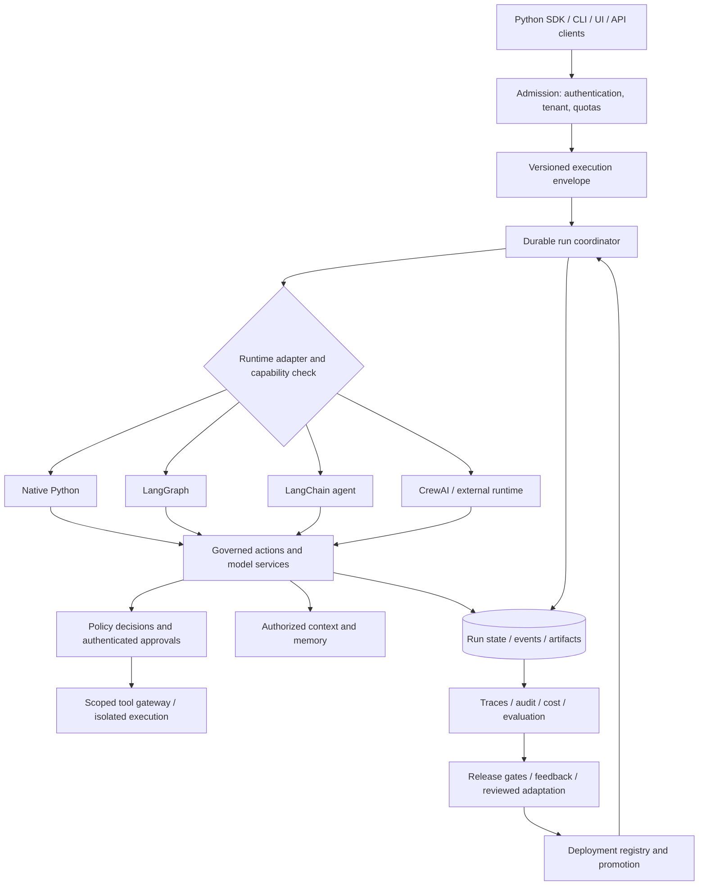

# Target architecture: portable agents with enforceable guarantees

**Follow-up status (2026-09-28):** consult [CURRENT_STATUS.md](CURRENT_STATUS.md), [live results](LIVE_BENCHMARK_RESULTS.md), and [the updated novelty gate](RESEARCH_GATE_20260928.md). Proposed requirements below are not all implemented; original measurements remain dated evidence.

This is a proposed design, not a description of completed implementation. It preserves native Python, LangGraph, LangChain, and CrewAI as useful options. It does not require rewriting every framework as a LangGraph graph.

## Product contract

A developer defines an agent's purpose, tools, permissions, state, and success criteria. The platform supplies execution, recovery, observation, evaluation, and deployment. An application can start as a single Python process and later use managed workers without redefining its business logic.

The first stable release should promise specific supported capabilities, not “any agent.” Long-running workflows, assistants, retrieval, research, and approved business operations are plausible targets. Hard real-time control, unbounded autonomous financial decisions, and arbitrary untrusted code require additional domain/runtime boundaries. Industry flexibility comes from contracts and integrations; industry assurance comes from application evidence.

## Component and trust boundaries



The arrows describe required integrations. An opaque external agent may lack some of them and must advertise that limitation. Tool gateway enforcement and execution isolation must protect resources even if an LLM ignores instructions. A Python object inside an untrusted process cannot be an effective security boundary against code in that same process.

## 1. Small domain kernel

Introduce versioned domain types with no dependency on LangGraph state dictionaries:

| Contract | Required meaning |
| --- | --- |
| `AgentDefinition` | Immutable definition/version, instructions, model requirements, tools, output contract, declared capabilities |
| `ExecutionEnvelope` | Tenant, caller, service principal, run ID, thread ID, parent run, deadline, cancellation reference, budget reference, policy version, memory scopes, trace context |
| `ActionRequest` | Tool/version, validated arguments, action ID, idempotency key, caller/delegation context, declared side-effect class |
| `PolicyDecision` | Typed allow/deny/approval decision, rule IDs, evaluated policy version, obligations, validity interval |
| `ApprovalRecord` | Exact action/arguments digest, requestor, authorized approver, decision, expiry, policy/version binding |
| `RunEvent` | Stable event type/version, sequence, timestamps, lineage, outcome, usage, redacted references to artifacts |
| `RunResult` | Content/artifacts, terminal execution status, independently measured business outcome, usage, policy events, resumability |
| `StateRevision` | State schema version, prior revision, ownership/fencing token, checkpoint references |
| `EvaluationResult` | Measured value, pass/fail/not-measured, oracle version, confidence/uncertainty, provenance |

Keep `thread_id` for a conversation and `run_id` for one execution. Do not use a single string to stand for thread, trace, retry attempt, deployment, and tenant.

## 2. Runtime adapter contract

The kernel should call adapter methods directly, rather than require every adapter to impersonate a compiled LangGraph object. A proposed interface is:

```python
# Design sketch only; not an implemented public API.
class RuntimeAdapter(Protocol):
    def capabilities(self) -> RuntimeCapabilities: ...
    async def start(self, definition, envelope, input) -> RunHandle: ...
    async def events(self, handle) -> AsyncIterator[RunEvent]: ...
    async def resume(self, handle, approval_or_input, envelope) -> RunHandle: ...
    async def cancel(self, handle, reason) -> CancellationResult: ...
    async def inspect(self, handle) -> RunSnapshot: ...
```

Separate a topology representation from an execution implementation. Either compile a deliberately small portable workflow representation into adapters, or allow native framework definitions with declared requirements. Do not promise that every arbitrary CrewAI Flow or LangGraph graph can be losslessly translated into every other runtime.

Capability negotiation should cover action-level authorization, caller propagation, cooperative/hard cancellation, streaming granularity, durable pause/resume, checkpoint migration, structured output, parent-child budgets, and isolated code. Required-but-unsupported capability means deployment validation fails.

| Support level | Meaning | Appropriate use |
| --- | --- | --- |
| Fully governed | Conformance suite establishes the required action and lifecycle guarantees | Enterprise workflows within the declared deployment profile |
| Governed tool adapter | Framework calls platform tools through the protected gateway; other internal behavior remains framework-specific | Existing framework applications adopting controlled actions |
| Opaque external agent | Coarse input/output contract; internal steps cannot be inspected or governed | Restricted subprocess/service with narrow credentials and explicit limits |

Native and LangGraph should be the reference implementations first. LangChain tools must use governed wrappers. CrewAI should gain full status only when its actual version and execution hooks satisfy the tests; until then, the outer-agent bridge remains honestly labeled.

## 3. One governed action lifecycle

1. Authenticate the caller and select a versioned deployment. Reject tenant mismatch and missing required context.
2. Intersect caller authority, delegated worker authority, tool capability, and application policy. Reserve a bounded budget and check deadline/cancellation.
3. Validate tool schema, canonicalize arguments, classify the side effect, and resolve credential/egress requirements.
4. Evaluate **all hard denials**, then any approval obligation. Policy errors follow an explicit failure policy; sensitive actions fail closed.
5. Persist an action intent. If approval is needed, pause durably and show the exact effect, recipients, amount/data scope, and approver requirements.
6. On resume, authenticate current authority, verify the approval binding, and re-evaluate policy. Reject stale or changed actions.
7. Claim execution ownership and idempotency. Execute in the appropriate trust boundary with scoped credentials and bounded resources.
8. Record the outcome, downstream effect identifier, usage, and state revision. Publish redacted events.
9. Feed observations back into the agent as data. Apply output schema/authorization checks and evaluate the business outcome independently.

Retries must distinguish read-only operations, idempotent writes, and irreversible actions. An agent should not retry a payment because a response timed out unless it can query the original operation or use a downstream idempotency key. Compensation is a domain operation with its own authorization, not a universal undo function.

## 4. Durable execution and scale

Choose a concrete ownership mechanism and keep it testable. For an initial deployment, a single active worker per thread/run plus fenced storage writes is simpler than concurrent mutation of shared histories. A durable queue admits work; workers have leases/heartbeats, a bounded concurrency limit, and graceful shutdown. Persistent state includes schema version, events, action intents/results, approvals, and resumption points.

Use Postgres for durable transactional metadata if appropriate, Redis for ephemeral coordination/cache with explicit loss semantics, and object storage for large artifacts. These are proposed deployment choices, not mandatory SDK dependencies. Existing state-store protocols can evolve to revision-aware writes.

Select a mature workflow engine for workflows that need multi-day durable timers, extensive retries, and operations tooling if maintaining those semantics internally would dominate the team. An external workflow system does not remove the need to govern agent tools or avoid replaying effects.

Scale by partitioning independent tenants/runs, applying per-tenant and per-provider admission limits, bounding fan-out, and streaming large artifacts by reference. Measure queue delay separately from execution time. Test cold start, warm state, cancellation, recovery, and noisy neighbors. Autoscaling on CPU alone may be ineffective for model/API-bound workloads.

## 5. Context and adaptive behavior

Treat context as a governed data product:

- Keep immutable source references and document versions; attach tenant, ACL, origin, timestamps, trust level, and retention metadata.
- Separate working context, episodic run history, durable user preferences, domain knowledge, and procedural skills. Each has different ownership and deletion rules.
- Retrieve from authorized data, combine lexical/semantic signals where useful, rerank with measured benefit, and allocate tokens by task needs. Evaluate recall and task success under fixed context budgets.
- Compact old context while preserving decisions, tool results, pending approvals, provenance, and unresolved tasks. Summaries must not silently replace authoritative business records.
- Validate writes to long-term memory; never promote arbitrary tool content into trusted instructions. Provide correction, quarantine, expiry, and deletion.

“Adaptive” should mean a bounded controller, not unreviewed self-modification. Begin with transparent rules for model selection, retrieval budget, and single-versus-multi-agent routing. Later learn from approved feedback using held-out evaluations. Freeze policy authority and test sets. Proposed adaptations receive version IDs, offline gates, shadow evaluation, canary rollout, and rollback. The objective includes quality, risk, latency, and cost; optimizing a single uncalibrated KPI invites failure.

## 6. Control plane and developer experience

Ship one coherent path: scaffold → local test → inspect trace → evaluate → deploy → operate → improve. Generated projects should include a fake provider, typed tools, a restrictive starter policy, a small domain dataset, an approval example, deployment configuration, and a clear upgrade path.

The control plane needs agent/deployment versions, tenant membership, scoped secrets, quotas, release gates, audit access, run search, approval inbox, failure inspection, retry/replay controls, and rollback. Avoid requiring a large control-plane installation for a local read-only prototype.

Suggested packages are `foundry-core`, `foundry-native`, `foundry-langgraph`, framework adapters, serving/control-plane components, and evaluation integrations. These names are illustrative; split packaging only when it simplifies dependency isolation and ownership. Avoid creating many packages before contracts stabilize.

## 7. Industry packs

An industry pack should contain tool contracts/connectors, permitted actions and approval policy, data classification/retention configuration, representative evaluation data, failure scenarios, operational runbooks, and domain-owner sign-off. A prompt template alone is insufficient.

| Initial proof application | What it establishes | Extra controls |
| --- | --- | --- |
| Support/refund assistant | Retrieval, tool use, multi-turn interaction, approved write, escalation | Refund limits, customer authorization, policy compliance, state-based outcome |
| Procurement/internal operations | Multi-agent delegation, documents, multi-step approval, retries | Separation of duties, vendor/amount controls, duplicate-order prevention |
| Enterprise knowledge assistant | Tenant/document isolation, grounding, memory, correction | ACL revocation, citations, poisoning tests, deletion/retention |

Healthcare, financial services, legal work, and industrial operations need their own expert-defined constraints and deployment review. Passing these three applications establishes useful breadth; it does not certify every industry.

## Build, integrate, defer

**Build:** the execution envelope, consistent governed actions, adapter conformance, useful run events, deployment validation, and opinionated starter projects. These directly address the observed defects and differentiate the product.

**Integrate:** identity providers, secrets management, durable storage, telemetry backends, isolated execution, and public benchmark harnesses. Keep provider-specific adapters replaceable.

**Defer until measured:** automatic topology search, unrestricted self-improvement, sophisticated temporal graph memory, a large visual canvas, and numerous thin framework bridges. Add them when an application or controlled experiment shows value.
